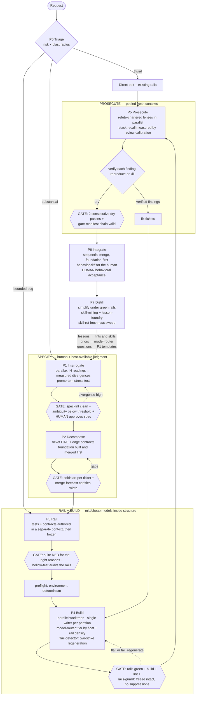

# The Agentic Development Lifecycle (ADLC)

A development lifecycle designed around the actual failure modes of frontier models —
not a re-skin of the SDLC with agents playing the human roles.

---

## 0. Thesis

The SDLC is a 60-year accumulation of defenses against **human** failure modes:
forgetfulness, ego, fatigue, fear of blame, communication cost, knowledge silos.
Standups exist because humans don't share state. Code review exists because humans
have ego-blind spots. Estimation rituals exist because humans dislike admitting
uncertainty.

Models have a **different** flaw profile. Copying SDLC rituals wholesale does two
bad things at once: it imports defenses against flaws models don't have (an agent
doesn't need a standup; it coordinates through artifacts), and it misses flaws
humans don't have (no human hallucinates an entire API surface with full
confidence; no human deletes a failing test at 2am and reports "all green" —
well, almost no human).

**Design rule: every phase, gate, and loop in this lifecycle must trace to a
specific model failure mode it defends against, or a specific model property it
exploits. If it traces to a human failure mode instead, cut it.**

---

## 1. The Flaw Inventory (design inputs)

These are the load-bearing facts. Everything downstream derives from this table.

| # | Model flaw | What it breaks | Design response |
|---|-----------|----------------|-----------------|
| F1 | **Premature satisfaction** — does the least that arguably satisfies the instruction, then declares victory | Implicit requirements silently dropped; stub data behind working UIs | Make satisfaction machine-checkable. Acceptance criteria must be executable, not prose |
| F2 | **Sycophancy / agreement bias** — biased toward telling its principal what they want to hear | Self-review is worthless; "does this look right?" always returns yes | Never ask an agent to validate work it (or its context) produced. Invert the charter: an agent told to *refute* wants to refute |
| F3 | **Context rot** — judgment degrades as context fills; early instructions fade; the model anchors on its own prior outputs | Long sessions drift; the builder cannot see its own bugs because its context *is* the bug | Atomic tasks, fresh context per task, pass conclusions between agents — never transcripts |
| F4 | **Confident hallucination** — fabricates APIs, claims fixes without running anything, invents findings during review | Trust in any unverified claim, in either direction (builder *or* critic) | Evidence or it didn't happen. Every claim gated by deterministic execution: tests, typecheck, build, repro |
| F5 | **Reward hacking** — under pressure to satisfy a gate, games the gate: deletes tests, weakens assertions, mocks reality, adds skip markers | Every metric you gate on gets Goodharted | Gates must be vacuous-proof. Rails authored in a separate context from the builder and frozen during build. See §5 |
| F6 | **Finding-count prior** — reviewers converge on ~10–20 findings and stop, regardless of how many exist | Single-pass review systematically undercounts | Loop until dry: repeat with fresh contexts until K consecutive passes find nothing new |
| F7 | **Generative bloat** — verbose, duplicative output; reinvents what exists three files away | Codebase grows 20–30% fatter than necessary; future context costs compound | Post-merge simplify phase (cheaper and more reliable than preventing duplication at authoring time) |
| F8 | **Coherence loss across models/sessions** — different models (and fresh sessions) have different idioms; mid-task switching produces stylistic and architectural seams | Mid-build model failover; "resume where the other one left off" | Pin one model per task. Switch models at task boundaries only |

And the flaws that are secretly **features** — this is the "works *because* of
them" half:

| # | Model property | Exploit |
|---|---------------|---------|
| E1 | **Sampling diversity** — N runs give N genuinely different attempts | Free ensemble. For *search* problems (find bugs, propose designs, hunt perf), fan out N attempts, dedupe, judge. N-version programming was always too expensive for humans; it's now nearly free |
| E2 | **Zealous charter compliance** — the same bias that makes self-review sycophantic makes a refute-chartered critic relentless | Adversarial review works not despite the agreement bias but because of it: you aim the bias at the work instead of at you |
| E3 | **No ego, no fatigue, no blame-fear** | Reviews can be brutal, loops can run 50 iterations, work can be thrown away wholesale. Discard-and-retry is a first-class strategy — regenerating from a corrected spec is often cheaper than repairing a flawed attempt |
| E4 | **Context rot has an inverse** — a *fresh* context is genuinely unbiased by the construction history | Fresh-context review is only valuable because contexts contaminate. This is why creator/critic works at all — and why the critic must never share the creator's context |
| E5 | **Cost asymmetry** — exploration, review, and rewriting approach free relative to human time | Move expensive activities (architecture review, dedup analysis, exhaustive review passes) from the front of the lifecycle to the back, where they have full information |

---

## 2. Principles

1. **Deterministic gates between every phase.** An LLM→LLM handoff without a
   deterministic checkpoint multiplies error rates. The chain is only as strong
   as its non-LLM links. Between any two phases there must be something that
   cannot hallucinate: a compiler, a test suite, a schema validator, a human.

2. **Evidence or it didn't happen.** "I fixed the bug" is a claim. A failing
   test that now passes is evidence. This applies symmetrically to critics: a
   review finding is a claim until reproduced. Unverified findings are noise
   that burns build-agent tokens chasing ghosts (F4 cuts both ways).

3. **Never ask an agent to judge work its own context produced** (F2, F3, E4).
   Judgment requires a fresh context, an inverted charter, or ideally both.
   Cross-*model* review is a bonus, not the active ingredient — the active
   ingredient is fresh context + refute charter. (The "adversarial review"
   branding oversells the cross-vendor part.)

4. **Make satisfaction machine-checkable** (F1). The agent will do the minimum
   that satisfies the stated condition. So state conditions a machine can check,
   and let the minimum *be* the target. Vague criteria get the vague minimum.

5. **Protect the rails from the builder** (F5). Tests, contracts, and types are
   authored in a separate context, before implementation, and are read-only
   during build. A builder that can edit its own acceptance test will,
   eventually, edit its own acceptance test.

6. **Single writer per partition; fan out only for search.** Parallel
   *construction* on shared state produces merge hell — Brooks's law survives
   in the integration cost. Parallel *search* (bug hunting, design alternatives,
   review dimensions) is where parallelism is nearly free (E1). The "3–7
   creators comparing notes while building" pattern confuses these two: it
   applies search-parallelism to a construction problem and pays for it in
   coordination noise.

7. **Model tier = f(cost of *detecting* an error), not task prestige.**
   - Cheap models (Haiku-class) where the rails catch errors instantly and
     deterministically: codemods, mechanical refactors under test, formatting,
     dedup with green suites, triage classification.
   - Mid models (Sonnet-class) for the build phase proper — errors here are
     caught by rails + prosecution, so paying for perfection is waste.
   - Frontier-tier (the *best model you are allowed to run* — the doctrine
     assumes an Opus-class ceiling, see Appendix E) where errors are
     *expensive to detect*: specs, decomposition, interface contracts, final
     verdicts. A subtly wrong contract sails through every gate and poisons
     everything downstream.

   This inverts the common instinct (best model writes the code). The code is
   the most-verified artifact in the system; the spec is the least.

8. **Loop divergence is information.** Every loop carries a max-iteration count,
   a dry-pass exit (F6), a token budget, and a human escalation path. A
   creator/critic loop that won't converge is not under-iterated — it is telling
   you the spec is contradictory or the partition is wrong. More iterations
   launder the signal into cost.

9. **Barbell the token spend.** Heavy at the ends — interrogation/spec and
   prosecution/verification — light in the middle, where skills and rails make
   building cheap. A team whose spend is concentrated in the build phase is
   exploring (re-reading the codebase every run) instead of exploiting (skills,
   cached context, atomic tickets).

10. **Every artifact the next agent reads is a cache. Caches need invalidation.**
    Skills, specs, memory files, CLAUDE.md — all of it goes stale and then
    actively injects misinformation with the voice of authority. Date-stamp it,
    re-mine it idempotently (Distill phase), and treat "verify before
    recommend" as policy for anything recalled rather than read.

---

## 3. The Lifecycle

```
P0 Triage ──► P1 Interrogate ──► P2 Decompose ──► P3 Rail ──► P4 Build ──► P5 Prosecute ──► P6 Integrate ──► P7 Distill
   │              │ human gate       │ cold-start      │ RED gate    │ green gate   │ zero-findings    │ human gate      │ feeds P1..P4
   └─ small fixes skip to P3 (rail the bug, fix, prosecute-lite)                          gate                            of next run
```



### P0 — Triage

Not everything earns the full lifecycle. Route by **risk × blast radius**, not
size:

- **Trivial** (typo, copy change, config tweak with existing coverage): direct
  edit + existing rails + one prosecution pass. Cheap model.
- **Bounded** (bug fix, small feature inside one partition): skip to P3 — write
  the failing test that *is* the bug report, fix, prosecute-lite.
- **Substantial** (new feature, cross-cutting change, migration): full lifecycle.
- **Architectural** (new system, contract changes): full lifecycle + design
  alternatives via judge panel in P1.

Running the full ceremony on a typo is how ADLCs die of friction in week two.

### P1 — Interrogate

**Defends against:** F1 (implicit requirements), F4 (the model filling gaps
with invention). **Exploits:** E5 (interrogation is cheap; downstream rework is
not).

The single highest-leverage phase, because error here compounds through every
phase after, and no downstream gate can catch "built the wrong thing correctly."

Mechanics:

- Grillme-style interrogation: *ask me questions until you have none left, but
  check the codebase before asking each one.* The codebase-check clause is the
  half that matters — without it you get twenty questions the repo already
  answers, and the human tunes out.
- The common framing ("planning reduces non-determinism") is wrong in a way
  that matters. Sampling randomness is not the enemy — at temperature 0 a vague
  spec still yields confidently wrong code. The enemy is **underspecification**:
  the model fills every gap with its prior, and its prior is "whatever is most
  generic." Interrogation works by transferring the spec from your head into
  the context before the gaps get filled by invention.
- Output: a spec where **every acceptance criterion names its verification
  method** — a test to be written, a command whose output is asserted, a
  behavior demonstrated. A criterion with no verification method is a wish,
  and wishes get the F1 treatment.
- For architectural work: fan out 2–3 design alternatives from *differently
  anchored* prompts (MVP-first, risk-first, ops-first), judge, synthesize (E1).

**Gate:** human approves the spec. This is the human's highest-value moment in
the entire lifecycle — minutes here replace hours of diff review later.
Frontier model. Do not economize in this phase.

### P2 — Decompose

**Defends against:** F3 (context rot). The unit of work is sized to the
*useful* context window — the region before judgment degrades — not the
advertised one.

Mechanics:

- Slice the spec into atomic tasks, each executable by a fresh agent from the
  ticket alone.
- Draw partition lines along interfaces, and write the **contract at each
  boundary explicitly** (types, schemas, endpoint shapes). Contracts are what
  let P4 parallelize safely — parallel agents that collide do so on shared
  types, deps, and configs, never on the feature code. Pin the shared surface
  first and parallel construction stops colliding.
- Identify the truly sequential spine vs. the parallelizable leaves.

**Gate — the cold-start test:** hand each ticket to a fresh, *cheap* model and
ask "what's missing to execute this?" If the cheap model can enumerate the
gaps, the ticket is underspecified for the mid model that will actually run
it. Costs pennies; catches the #1 cause of build-phase flailing.

### P3 — Rail

**Defends against:** F5 (reward hacking), F2 (self-validation), F4 (claims
without evidence). This phase exists because of a single inversion:

> **In the SDLC, tests verify the code. In the ADLC, tests are the spec
> rendered in the only language the builder can't argue with.** A test is the
> one critic that is never sycophantic, never rots, and never hallucinates.

TDD's role therefore changes. It is not a quality ritual or a discipline
signal — it is the **load-bearing trust mechanism** of the entire lifecycle.
Every other gate is probabilistic; this one is not.

Mechanics:

- Tests, type stubs, and contracts are authored from the spec **in a context
  that will never see the implementation**, before any implementation exists.
- Rails are **frozen during P4**: the builder cannot edit test files, contract
  types, or CI config. Enforce mechanically (hook, branch protection, file
  permissions), not by instruction — instructions are exactly what F5 routes
  around under pressure.
- Audit the rails themselves once: do the tests assert behavior, or do they
  assert that mocks were called? A mock-shaped test suite is a gate made of
  fog. (One adversarial pass over the *tests* before freezing them.)

**Gate:** the suite runs RED for the right reasons (failures are "not
implemented," not "test is broken"), and stubs typecheck.

A note on coverage: **do not gate on coverage percentage.** Coverage is the
most Goodhartable metric in software, and agents Goodhart at machine speed —
assert-free tests, snapshot spam, exercising lines without checking outcomes.
If you need a quantitative gate, mutation score is the honest version; the
adversarial test-audit is the cheap version.

### P4 — Build

**Defends against:** F3 (fresh context per ticket), F8 (one model per task).
**Exploits:** E5 (regeneration is cheap).

Mechanics:

- One fresh agent per ticket: ticket + relevant skills + frozen rails. No
  carry-over context between tickets.
- Parallelize across partitions via worktrees (sandboxes for hostile-blast-radius
  work), **single writer per partition** (Principle 6). Merge sequentially;
  rebase survivors after each merge.
- Mid-tier model by default — P3 and P5 are paid for precisely so this phase
  doesn't need a frontier model. Cheap model where rails are dense.
- **Two-strike regeneration rule:** if an agent flails (loops on the same
  error, starts modifying things outside the ticket), do not coach it inside
  the same rotting context. Kill it, improve the *ticket*, start fresh (E3).
  The second-cheapest fix is a fresh start; the most expensive is a long
  conversation with a confused agent. If the regeneration also fails, the
  ticket is wrong — escalate to P2, not to a bigger model.
- On personas: **reject.** "You are a senior Next.js engineer with 15 years of
  experience" adds vibes, not capability. An agent is its context + tools +
  charter + gate. Skills add capability; charters (goal, constraints, stop
  condition) add direction; costumes add tokens. The transcript's
  "charter personas as team members" pattern works where it works because of
  the attached skills and the conflict charter — keep those, drop the
  theater.

**Gate:** rails green, build passes, lint passes. Deterministic, no opinions.

### P5 — Prosecute

**Defends against:** F2, F6, F4-as-critic. **Exploits:** E1, E2, E4.

Not "code review." Prosecution: fresh contexts chartered to refute, with the
burden of proof on the *finding*.

Mechanics:

- **Dimension fan-out:** parallel reviewers, each owning one lens —
  correctness, security, contract conformance, the spec-vs-implementation
  diff, *and one reviewer auditing the tests the builder added* (unit tests
  for internals, written during P4, are allowed — they just get prosecuted
  too). One lens per context; a reviewer with five concerns has the judgment
  of none (F3 in miniature).
- **Refute charters, not review charters.** "Find what's wrong, and if you
  find nothing say so" outperforms "review this" because it aims the
  compliance bias at the artifact (E2).
- **Findings are claims** (Principle 2). Every finding goes to a *verifier*
  agent: reproduce it or kill it. Unverified findings forwarded to the builder
  are the dominant failure mode of naive creator/critic loops — the builder
  dutifully "fixes" hallucinated bugs, churning real code to address fake
  issues.
- **Loop until dry** (F6): re-run the fan-out with fresh contexts until 2
  consecutive passes produce zero verified findings. The ~10–20 finding
  plateau of a single pass is a model prior, not a coverage certificate.
- **Convergence budget** (Principle 8): max N rounds. Hit N without drying
  out → stop and escalate; the spec or partition is wrong.

Cross-model prosecution (Codex reviewing Claude's work, or vice versa) is a
legitimate marginal improvement — different training, different blind spots —
but it is the *third* most important ingredient, after fresh context and
inverted charter. Teams blocked from multi-vendor access lose little; teams
that cross-model with a *shared* context lose everything.

**Gate:** zero verified open findings, rails still green, rails diff is empty
(prove the builder never touched them).

### P6 — Integrate

**Defends against:** the human failure mode of pretending to review.

The 5,000-line diff read is litmus theater: the human scrolls, pattern-matches
for nothing in particular, approves, and the org books "human in the loop."
The human's attention is the scarcest resource in the lifecycle — spend it
where machines are blind:

- **Read the spec-conformance summary**, not the diff: what was promised, what
  was verified, what was explicitly not done.
- **Read the test diff** — small, high-signal, and it *is* the behavioral
  contract.
- **Run the thing.** A two-minute demo catches the category of wrongness no
  reviewer-agent can: "this is technically correct and not what I meant."
- Spot-check 2–3 hotspots flagged by prosecution, not the whole surface.

Merge sequentially. Worktree branches integrate one at a time with rebases
between (squash-merge recovery per the worktree conventions). No parallel
builds across worktrees.

**Gate:** human behavioral acceptance. Second of the two human gates.

### P7 — Distill

**Defends against:** F7 (bloat), and the meta-failure of a lifecycle that
doesn't compound. **Exploits:** E5 — architectural review with *full
information* is cheap now, so it moves to where the information is.

Two halves:

1. **Simplify.** Post-merge agentic pass: dedupe, extract shared libraries,
   clarity-over-cleverness rewrites, dead-code removal — all under the
   now-green, still-frozen rails. The transcript is right about this and right
   about *why*: deduplicating before the code exists is speculative (and
   non-determinism means the duplication may never materialize where you
   guarded against it); deduplicating after is mechanical. This is the classic
   ADR/design-review moved to the back of the cycle because exploration became
   free. Expect 20–30% reduction on agent-generated code. Cheap-to-mid model;
   the rails carry the risk.

2. **Mine.** Skill-mine the codebase (idempotently — refresh stale skills,
   delete dead ones), bank what this run learned (recurring prosecution
   findings become lints or skills; recurring interrogation questions become
   spec templates), and update shared memory. **Shared and versioned** —
   off-board memory in one developer's local markdown is a cache with one
   client; skills in the repo are a cache the whole team and every future
   agent hits.

This phase is the compounding loop: it is why run N+1 is cheaper than run N,
and skipping it is why teams see costs stay flat while codebases bloat. A
recurring prosecution finding that doesn't become a lint rule or a skill is a
lesson the org paid for and refused to keep — and it will be found, and paid
for, again next sprint.

---

## 4. Norms Rejected

Explicit positions, with reasons. Disagree with these deliberately, not by
default.

| Norm | Verdict | Why |
|------|---------|-----|
| Human review of full agent diffs | **Reject** | Theater past ~500 lines. Human attention goes to spec, test diff, behavior (P6) |
| Agile-weight planning ("working software over documentation") | **Reject for agentic work** | Agile economized on planning because human building was slow and specs went stale. Building is now fast and cheap; *mis*building is what's expensive. The economics inverted, so the phase weighting inverts |
| Persona engineering | **Reject** | Capability lives in skills/tools/charters. Costumes are token overhead (P4) |
| Multi-agent collaborative *construction* (3–7 creators comparing notes) | **Reject** | Search-parallelism misapplied to construction. Partition + contract + single writer instead (Principle 6) |
| DRY at authoring time | **Reject** | Dedup moves to P7 where it's mechanical, not speculative |
| Coverage % as a quality gate | **Reject** | Goodharted at machine speed. Mutation score or adversarial test audit (P3) |
| Token quotas as cost control | **Reject** | Caps the wrong variable. A quota-pressured developer cuts the prosecution phase first — the most expensive *and* most valuable tokens. Govern cost-per-merged-verified-change; let the gates, not the wallet, end loops. ($1k/week on a real perf improvement is ~2% of a senior engineer's loaded cost. The right question was never "is $1k too much" — it's "did it merge, verified?") |
| Output-style compression (caveman-speak) as the economy lever | **Mostly reject** | Output tokens are a minor line item in agentic loops; the spend is repeated input-context reads, cache misses, and re-exploration. Fix with skills, atomic tickets, conclusion-passing, and prompt-cache discipline. Worse: output is the model's working medium — degrading the language risks degrading the reasoning to save the cheapest tokens in the system. (The "providers pad tokens for revenue" framing is vibes, not analysis) |
| Cross-model review as *the* mechanism | **Demote** | Active ingredients are fresh context + refute charter. Cross-model is a real but third-order bonus (P5) |
| Mid-task model failover | **Reject for dev loops** | Right for production inference, wrong mid-task (F8). Models switch at task boundaries |
| Evals as the testing story for ADLC | **Scope correctly** | Evals are TDD for *agent products* (non-deterministic outputs need domain-of-response assertions). When agents build *deterministic software*, the tests are the evals. Conflating these makes teams build eval harnesses for CRUD apps |

---

## 5. The Goodhart Annex

Agents game gates at machine speed and report success sincerely. Every gate
ships with its anti-vacuity defense, or it isn't a gate.

| Gaming move | Defense |
|------------|---------|
| Delete / edit the failing test | Rails frozen during P4, enforced mechanically; P5 verifies rails diff is empty |
| Weaken assertions (`toBeDefined()`, snapshot churn) | Adversarial test audit in P3; prosecution lens on builder-added tests in P5 |
| Mock the thing being tested | Test-audit question: "does any test fail if the feature is deleted?" |
| `skip` / `xfail` / lint-suppress markers | Deterministic grep gate in CI: new suppressions fail the build unless declared in the ticket |
| "Fixed" without running | Claims require execution evidence in the gate itself, not in the agent's report (Principle 2) |
| Coverage padding (exercise without asserting) | Don't gate coverage (see P3); mutation-test the suite periodically |
| Critic invents findings to satisfy "find problems" charter | Verifier stage: reproduce or kill, before anything reaches the builder |
| Out-of-ticket "improvements" that mask scope creep | Diff scoped to ticket's declared files; out-of-scope changes auto-flagged to P6 human |

---

## 6. Economics

**The unit of account is cost per merged, verified change** — not tokens per
developer per month. Token-efficiency improvements that lower merge quality
are losses wearing savings costumes.

Target spend shape (barbell, Principle 9):

```
P1 Interrogate  ██████░░    heavy — frontier model, human time, cheap insurance
P2 Decompose    ███░░░░░    moderate — frontier for contracts
P3 Rail         ███░░░░░    moderate — one-time per feature
P4 Build        ██░░░░░░    light — skills + rails make this cheap; mid/cheap models
P5 Prosecute    ██████░░    heavy — fan-out × loop-until-dry; this is where quality is bought
P6 Integrate    █░░░░░░░    human minutes, not hours
P7 Distill      ██░░░░░░    light — and it's the phase that discounts every future run
```

Diagnostics:

- **Spend concentrated in P4** → the team is re-exploring the codebase every
  run. Missing skills, oversized tickets, or no Distill phase.
- **P5 spend trending up over time** → P7 isn't converting findings into
  lints/skills; you're re-buying the same lessons.
- **P5 loops hitting max iterations** → specs are underdetermined; the
  problem is in P1, the bill shows up in P5.
- **Spend flat run-over-run** → the compounding loop is broken. The whole
  point of P7 is that the curve bends down.

---

## 7. Adoption

The one piece of the transcript that is unambiguous field wisdom: **existing
teams do not adopt platonic lifecycles; they adopt relief from their worst
pain point**, then ask what else hurts. Sequencing for a real team:

1. **Prosecution of existing PRs** (P5, standalone). Highest pain (nobody
   wants to review the 5,000-liner), zero workflow change, trust built on
   verified findings the team can check themselves. With finding-verification
   included from day one — one hallucinated finding wastes an hour of human
   time and burns a week of credibility.
2. **Rails** (P3). "You hate writing tests? The agent writes them from the
   spec; you audit them once." This quietly installs the trust anchor
   everything else hangs on.
3. **Interrogation** (P1). Once the team has watched agents miss implicit
   requirements, the case for grillme-style spec sessions makes itself.
4. **Full loop with parallelism** (P2/P4/P6/P7). Last, because worktree
   parallelism and distillation only pay off once 1–3 are habits.

Anti-pattern: mandating the full lifecycle org-wide on day one. The ceremony
overhead lands before the compounding gains do, the quota anxiety kicks in
(see §4), and the org concludes "agents don't work here."

---

## Appendix A — Phase → Mechanism map

| Phase | Concrete mechanism (current ecosystem) |
|-------|----------------------------------------|
| P1 | grillme-style interrogation skill; spec skills; judge-panel workflows for design alternatives |
| P2 | Epic/ticket breakdown with "full context per ticket" constraint; cold-start check via cheap-model pass |
| P3 | TDD skill in a dedicated context; CI branch protection on test paths; pre-commit hooks freezing rail files |
| P4 | Fresh agent per ticket; git worktrees in `.worktrees/` (per existing conventions); sandboxes for high-blast-radius work; two-strike regeneration |
| P5 | `npx adversarial-review` (fresh-context cross-model review, deterministic exit codes for CI gating, loop-until-approve); dimension-fan-out + verify workflows; loop-until-dry orchestration |
| P6 | PR agents (Vercel Agent / Jules / equivalents) as *pre-digesters* for the human, not replacements; spec-conformance summaries |
| P7 | Simplify/refactor agents under green rails; `npx skill-mining` (five-axis scoring, dedup against public registry, adversarial Gates A/B, fresh-context validation); shared skill registry in-repo |

## Appendix B — The two human gates

The entire lifecycle has exactly two mandatory human moments, by design:

1. **P1: "Is this what I meant?"** (spec approval)
2. **P6: "Is this what I meant, running?"** (behavioral acceptance)

Everything between them is machine-gated. Humans intervene elsewhere only on
escalation (non-converging loops, out-of-scope flags, contract changes).
This is not human-out-of-the-loop; it is human-at-the-two-points-where-
human-judgment-is-irreplaceable, instead of human-as-tired-diff-scroller.

## Appendix C — The Missing Toolkit

Tools that should exist and mostly don't. Same DNA as `adversarial-review` and
`skill-mining`: small, `npx`-runnable, zero-dependency where possible, fresh
contexts by construction, deterministic exit codes (0 = pass, 2 = gate fails)
so every one of them can sit in CI. Ordered by phase, with a build-priority
verdict at the end.

### C1. `spec-lint` — P1 gate

Audits a spec: **every acceptance criterion must name its verification
method** (a test, a command whose output is asserted, a demo step). Criteria
without one are wishes, and wishes get the F1 treatment. Mechanical checks
plus one cheap-model pass for criteria that name a method vacuously ("works
correctly"). Exit 2 lists the wishes. Trivial to build; converts the P1 gate
from judgment to lint.

### C2. `premortem` — P1 stress test

Fresh context, frontier model, given the approved spec, one charter: *"It is
three months from now and this project failed. Write the postmortem."*
Inverts sycophancy the same way adversarial-review does — an agent asked "any
problems with this plan?" says no; an agent asked to explain a failure that
already happened invents concrete, checkable risks. Output feeds back as
interrogation questions. Cheap, runs once per spec.

### C3. `coldstart` — P2 gate

The cold-start test as a CLI. Each ticket goes to a *cheap* model in a fresh
context with one charter: "list everything missing to execute this without
asking a single question." Empty list → exit 0. Non-empty → exit 2 with the
gap list appended to the ticket. Pennies per ticket; catches the #1 cause of
build-phase flailing before a mid-tier model burns dollars discovering it.

### C4. `hollow-test` — P3 gate (diff-scoped mutation)

The honest replacement for coverage %. For the tests covering a diff: mutate
the *implementation* (invert conditionals, null the returns, swap operators,
plus a few LLM-authored semantic mutants), run the suite, and report any
mutant that survives every new test. A surviving mutant is proof of hollow
coverage — a test that exercises lines without constraining behavior.
Diff-scoping keeps it at minutes, not the hours that kill full mutation
testing. Exit 2 lists survivors. This closes three rows of the Goodhart annex
(assertion-weakening, mock-everything, coverage padding) with one
deterministic check.

### C5. `rails-guard` — P3/P4 enforcement

Mechanical enforcement of the rail freeze: a hook that blocks builder edits
to declared rail paths (test files, contract types, CI config) during P4, and
emits a **rails-diff-empty proof** at the gate. Also greps the diff for new
`skip`/`xfail`/lint-suppression markers and fails unless they're declared in
the ticket. Small, dumb, deterministic — which is exactly the point:
instructions are what F5 routes around; hooks aren't.

### C6. `flail-detector` — P4 supervisor

Encodes the two-strike regeneration rule mechanically. Watches a build
session for flail signatures: same error twice, edit-revert cycles, file
touches outside the ticket's declared scope, token spend past the ticket
budget. On trigger: kill the session, append the dead-ends to the ticket
("known failed approaches: …"), regenerate fresh. Second trigger: stop and
escalate to P2 — the ticket is wrong, not the agent. Nobody should be
coaching a confused agent inside a rotted context, and no human should have
to notice the flailing manually.

### C7. `consensus-fix` — P4, for hard bugs (exploits E1)

N-version programming, finally affordable. Fan N fresh agents at the same
failing test with zero shared context. Run every candidate fix against the
rails. Diff the survivors against *each other*: high agreement = high
confidence, take the smallest surviving diff; divergence = the spec is
ambiguous about something load-bearing — escalate with the divergence as
evidence. Sampling diversity turned from bug into measurement instrument.

### C8. `review-calibration` — P5 meta-gate ("who reviews the reviewer")

The most important missing tool. The prosecution stack is trusted blind —
nobody knows its recall, and recall varies silently per repo, per model, per
charter wording, per model *upgrade*.

Mechanics: take a real merged diff from repo history. Plant N
realistic bugs in it — mutation operators plus LLM-authored subtle ones,
spread across categories (off-by-one, auth bypass, race, contract violation,
error-swallowing). Run the full review stack against the planted diff.
Score recall and false-positive rate against the known plant list, per
category. Exit 2 if recall drops below threshold.

This is mutation testing aimed at the *reviewer* instead of the code. It
turns "we do adversarial review" from a vibe into a number, exposes
category-level blind spots (low recall on races → add a dedicated
concurrency lens), and re-runs on every model change — catching the silent
regressions everyone currently absorbs unknowingly. The calibration score
itself belongs in the gate manifest (C11): a review verdict means more when
it carries the measured recall of the stack that produced it.

### C9. `lesson-foundry` — P7, the compounding closer

The §6 diagnostic "P5 spend trending up = re-buying the same lessons" exists
because no tool converts findings into permanent defenses. This one does.

Mechanics: verified prosecution findings accumulate in a JSONL ledger across
runs (adversarial-review output is the natural feed). Foundry clusters
recurrences, then routes each cluster to its **cheapest permanent defense**:

- **Deterministic-able** → author a lint rule or grep gate, *with a test for
  the rule*, PR'd like any code.
- **Contextual** → emit a skill candidate into the skill-mining pipeline
  (Gates A/B apply as usual).
- **Spec-gap** → append a question to the interrogation template, so P1 asks
  it forever.

Every defense gets fresh-context validation before landing. The effect is a
ratchet: each lesson is paid for exactly once, and recurring findings get
demoted from probabilistic detection (LLM review, ~dollars per catch) to
deterministic detection (lint, ~free forever). This is the tool that makes
run N+1 measurably cheaper than run N.

### C10. `skill-rot` — P7 cache invalidation

Skills are caches and nothing invalidates them. For each SKILL.md: extract
its verifiable claims (commands, paths, package versions, API names), check
them against the current repo — mechanically where possible, cheap-model
where not — stamp `last-verified`, exit 2 with the stale list. Weekly in CI.
A stale skill is worse than no skill: misinformation delivered in the voice
of authority, loaded by progressive disclosure into every future agent.

### C11. `gate-manifest` — cross-cutting provenance

Every gate appends a signed, machine-readable entry: tests run and result
hashes, rails-diff-empty proof (C5), prosecution verdicts and the
calibration score of the stack that issued them (C8), models used, token
spend per phase. A merge ships with its evidence chain — in-toto/SLSA, but
for agentic provenance.

Two payoffs. Enterprise: "prove this agent-written code was verified" gets a
mechanical answer, which is the adoption blocker in regulated orgs.
Operational: trust-differentiated policy — a thin manifest routes to a
heavier human gate automatically, a thick one fast-tracks. Human attention
allocated by evidence, not by line count.

### C12. `model-ratchet` — scheduled re-prosecution

Everyone reviews new code with the current model and never looks back. But
**every frontier model release is a free re-audit of the existing codebase**
— the new model finds what the old one missed. Cron: on model release (or
monthly), re-run the prosecution fan-out over main's hot paths (churn ×
criticality) with the newest models; verified findings become tickets and
feed the lesson-foundry. Codebase quality ratchets monotonically with the
frontier, for the cost of a scheduled job. Pairs with C8: calibrate the new
model's recall first, then aim it at the backlog.

### C13. `rejection-mining` — org boundaries (the telco pattern, generalized)

Sister of skill-mining: mines *people's recorded objections* instead of code
patterns. `gh`-scan historical PR review threads, declined PRs, and
security/platform/design-system rejection docs; cluster the recurring "no"s
per gatekeeper; author each cluster into (a) a prosecution lens and (b) a
pre-flight checklist skill. Result: "would security reject this?" is
answered in seconds pre-submit instead of in days post-queue. Every
recurring institutional objection becomes a gate the work passes *before*
it reaches the institution.

### C14. `behavior-diff` — P6 human-gate aid

The tool that makes "humans don't read 5,000-line diffs" actually workable.
Capture the observable surface before and after — API responses over a
fixture corpus, rendered routes via headless browser, CLI outputs, emitted
events — and diff in *behavior space*, rendered as a human-readable report:
"3 endpoints changed shape, this page reordered, this error message is new,
everything else byte-identical." The code diff is 5,000 lines; the behavior
diff is six items. The human reviews intent-vs-behavior — the one judgment
machines can't make — while the manifest (C11) proves the machines already
did the rest.

### Build priority (see also Appendix D tools)

| Tier | Tools | Why first |
|------|-------|-----------|
| **Now** | C9 lesson-foundry, C8 review-calibration, C4 hollow-test | Close the three biggest open loops: compounding (without C9 the lifecycle doesn't get cheaper), reviewer trust (without C8 prosecution is a vibe), rail integrity (without C4 the trust anchor is gameable) |
| **Cheap wins** | C3 coldstart, C1 spec-lint, C5 rails-guard | Days each, deterministic, immediately CI-able |
| **Differentiators** | C11 gate-manifest, C14 behavior-diff, C13 rejection-mining | Enterprise adoption unlocks — provenance, reviewable behavior, institutionalized "no"s |
| **Ratchets** | C12 model-ratchet, C7 consensus-fix, C2 premortem, C6 flail-detector, C10 skill-rot | Each exploits a model property (E1–E5) nobody is currently harvesting |

The through-line: `adversarial-review` made *review* independent and
gate-shaped; `skill-mining` made *knowledge* persistent and load-shaped. The
tier-one three make *trust* measurable (C8), *lessons* permanent (C9), and
*rails* honest (C4) — the remaining unmeasured, unpersisted, gameable parts
of the loop.

---

## Appendix D — Parallel Orchestration: The Three Dials

Parallel development has exactly three dials — **cost** (model selection),
**wall-clock** (fan-out), and **accuracy** (context quality) — and the central
fact about them is that they are not independent. Parallelism trades cost for
wall-clock *at constant accuracy only when the partition is clean*; with a bad
partition it trades cost for **negative** accuracy (contract drift, merge
hell, integration bugs). So the orchestration problem is, underneath,
a partitioning problem, and most of this appendix is about making partition
quality measurable before paying for the fan-out.

### D0. Architecture: lanes, not a boss agent

The first orchestration decision is the one most setups get wrong: **control
flow is code; judgment is models.** A frontier model "deciding what to do
next" is the most expensive, least reproducible scheduler ever built, and it
rots like any other context. The orchestrator should be a deterministic
workflow script — loops, DAG scheduling, gate checks — that *spawns* models
where judgment is needed and never consults one about sequencing.

```
                    ┌─────────────────────────────────────────┐
                    │ ORCHESTRATOR — deterministic script      │
                    │ (no model; topological scheduler)        │
                    └──┬──────────┬──────────┬──────────┬──────┘
                       │          │          │          │
              ┌────────▼───┐ ┌────▼─────┐ ┌──▼───────┐ ┌▼──────────────┐
              │ CONTRACT   │ │ BUILDER  │ │PROSECUTION│ │ INTEGRATOR    │
              │ DESK       │ │ POOL     │ │POOL       │ │ LANE          │
              │ frontier;  │ │ routed   │ │ shared;   │ │ cheap+determ.;│
              │ pins DAG-  │ │ tier per │ │ fresh ctx;│ │ continuous    │
              │ edge       │ │ ticket;  │ │ calibrated│ │ merge/rebase  │
              │ contracts; │ │ 1 writer │ │ (C8)      │ │ pipeline      │
              │ handles    │ │ per      │ │           │ │ (sequential   │
              │ escalation │ │ partition│ │           │ │  by necessity)│
              └────────────┘ └──────────┘ └───────────┘ └───────────────┘
                       ▲
              ┌────────┴────────┐
              │ AMBIGUITY ROUTER│  ← parallax (D3); humans see only
              │ cheap fan-out   │     measurably-ambiguous questions
              └─────────────────┘
```

Prosecutors are **pooled**, not paired with builders — the fresh-context
requirement (E4) means a prosecutor gains nothing from familiarity with "its"
builder, so dedicated pairing just buys idle time. Builders are **per
partition, single writer** (Principle 6). The integrator lane is sequential
by necessity (merges serialize) and is the system's bottleneck — which turns
out to determine fan-out width (D2).

### D1. The cost dial: model routing

Principle 7 (tier = cost of *detecting* an error), made mechanical.

**Route by escape cost, not task prestige.** For each ticket compute its
**rail density**: how much of its output is deterministically checked — test
coverage over the declared file scope, type strictness, contract tests on its
DAG edges, lint surface. The routing quantity is

> expected cost of an *escaped* error = P(error survives all gates) × blast radius

High rail density → errors are caught instantly and regeneration is cheap →
cheapest model that clears the gates is correct. Low rail density (specs,
contracts, migrations without coverage) → errors are expensive to *find* →
frontier model. The same logic that puts Opus on contracts puts Haiku on
codemods, and it's computable per ticket from artifacts that already exist.

**Escalation ladders, not static assignment.** Start cheap; on gate failure
or flail-detector trigger, *regenerate* one tier up with the failure appended
to the ticket as known-dead-ends. Never continue the failed context at the
higher tier (F8 — escalation is regeneration, not rescue). Toy math: Haiku at
0.1 cost-units / 60% first-pass, Sonnet at 1.0 / 90% — ladder expectation
≈ 0.1 + 0.4×(1.0 + …) ≈ 0.55 vs 1.0 for always-Sonnet, a ~45% cut. Two
honest caveats: failures correlate with ticket difficulty, so conditional
pass rates are worse than marginal ones (use conditional priors, below); and
the ladder costs latency on the failures, which leads to the one genuinely
non-obvious routing rule:

**Route by DAG float.** Critical-path method, applied to model selection.
Every ticket in the DAG has *float* — slack before it blocks anything.
Tickets **on the critical path** get latency-optimal routing: skip the
ladder, go straight to the tier with the highest first-pass rate, because a
retry there delays the entire delivery. Tickets **with float greater than
the expected retry latency** get cost-optimal routing: ride the ladder,
because their retries are absorbed by slack and cost nothing in wall-clock.
Same ticket content, different correct model — position in the graph, not
prestige of the work, decides.

**Priors from the gate-manifest, not from vibes.** Every gate-manifest entry
(C11) already records model × ticket-category × first-pass outcome. That
ledger *is* the routing table: per-repo, empirical, self-tuning, and it
re-converges automatically when a new model ships (with C8 calibration as
the cold-start estimate). Nobody routes this way today; everyone assigns
models by feel and never measures whether the feel was right.

**Tool: `model-router`** — reads ticket (declared scope, DAG position, rail
density) + gate-manifest history, emits `{model, mode: ladder|direct,
budget}`. Exit 2 if a ticket's rail density is below the floor for *any*
cheap tier — which is really a P3 finding wearing a routing costume: the
ticket isn't railed enough to build cheaply, and that's worth knowing before
spending either way.

### D2. The time dial: fan-out mechanics

**The schedule is a DAG, not a list.** P2's output should be tickets + edges,
where every edge carries an explicit contract. Scheduling is then just
topological: all ready nodes run concurrently, and completion events — not
wave barriers — trigger the next dispatch. Barrier waves ("finish all of
phase 2, then start phase 3") waste exactly the idle time the slowest ticket
imposes on the fastest; pipeline dispatch wastes none of it.

**Predict conflicts; don't resolve them.** Two parallel tickets that touch
the same file were never parallel — they were a merge conflict scheduled in
advance. Conflict probability per ticket *pair* is computable before any
agent runs, from three signals, each cheaper than one merge conflict:

1. **Declared file-scope overlap** (hard veto — overlapping scopes
   serialize, no model needed);
2. **Import-graph radius** — A writes files that B's scope imports →
   elevated risk, pin the shared interface at the contract desk first;
3. **Historical co-change coupling** — files that co-commit frequently in
   git history are logically coupled even when the import graph says
   otherwise. Mined once per repo, refreshed at P7.
4. **Namespace collisions** — the conflict class file analysis cannot see:
   two branches with *zero shared files* that still break the merged build.
   Route-segment conflicts (Next.js forbids `[pk]` and `[voteKey]` at the
   same path level), duplicate exported symbol names across new action
   files, colliding migration sequence numbers. Field-verified failure mode
   (parallel-development skill): scope overlap was clean, the merge still
   burned hours. Forecast these by diffing declared *namespaces* (routes,
   exports, migration ids), not just declared files.

High pair-score → sequence them or send the partition back to P2. This is
the partition-quality measurement the appendix opened with: fan-out width
should never exceed what the conflict forecast certifies.

**Width is set by integrator backpressure — which is why "3–5 agents" keeps
showing up.** Merges serialize: merge, rebase survivors, re-green, next. If
builds complete faster than the integrator lane absorbs them, the queue
grows and rebase costs compound with every open worktree. Steady-state
width is therefore

> width ≈ mean ticket build time ÷ mean merge-rebase-regreen time

— e.g. 20-minute builds over 4-minute integrations ≈ width 5. The 3–5
figure practitioners report isn't a mystical constant; it's this ratio for
typical ticket sizes, observed without being derived. Corollaries: you
*raise* useful width by making integration faster (build caching, cheap
re-green suites, smaller tickets' rebase surface) — not by spawning more
builders into a queue; and ticket size has an interior optimum (too small →
integration overhead dominates; too large → context rot + lost parallelism;
"one useful context window of work" is the target from P2, now with a
schedule-theoretic reason).

**Speculative execution against pinned contracts — and "pinned" means
merged.** Dependency edges don't have to serialize *work* — only *truth*.
Field experience (parallel-development skill) sharpens what "pinned" must
mean: a contract floating in a plan doc is not pinned; a contract is pinned
when the **foundation is built first and merged to main** — schema, shared
types, query functions, seed data — *before* the fan-out, and those
foundation paths are auto-appended to every parallel ticket's **rails**
(read-only, enforced by rails-guard). Builders consume the foundation; they
never reinterpret it ("read the actual query function before writing
consumer code — never guess property names"). With the foundation merged,
build downstream against it *while* upstream features build in parallel. The
contract is the synchronization point, exactly like issuing instructions
against a register promise. If upstream is forced to break the contract,
downstream regenerates — and E5 says regeneration is cheap, so speculation
pays whenever P(contract breaks) × downstream cost < downstream float
recovered. This recovers most of the parallelism the DAG appears to forbid,
and it's why the contract desk gets the frontier model: contract stability
is what makes the whole speculative schedule solvent.

**The integrator lane has its own craft.** Field-tested merge mechanics
worth encoding rather than rediscovering: merge order is foundation →
shared packages → apps, first-done-first-merged within a tier; conflict
resolution is file-type-aware (type/schema/barrel files combine both
additions; app-specific files shouldn't conflict at all — if they do, the
forecast missed); after a squash-merge to main, never `git rebase main`
(it replays pre-squash commits) — cherry-pick your unique commits onto a
fresh branch; and disable formatter hooks during conflict resolution, then
grep for stale conflict markers — formatters mangle `<<<<<<<` blocks into
syntactically valid garbage.

**Contracts compile to rails.** Every DAG-edge contract auto-generates a
consumer-driven contract test (Pact-style) into *both* adjacent tickets'
frozen rails. Partition boundaries — the place parallel accuracy actually
dies — thereby get deterministic enforcement, not reviewer opinion. A
builder that drifts from the contract goes red in its own worktree, minutes
after the drift, instead of at integration, hours after.

**Field notes from /team-develop** (worth encoding, not rediscovering):

- **Permissions preflight.** Before any fan-out, dry-run every operation
  class the fleet will use — git, worktree add/remove, branch ops, build
  commands, agent spawn, `gh` — so human-approval prompts front-load into
  one batch. A permission prompt mid-flight is a hidden serialization
  point: one blocked agent × N teammates = N stalls, racing siblings, and
  half-started state. Environment determinism is a precondition of
  parallel wall-clock math.
- **In-flight validators are a different organ than prosecution.** A
  validator paired with a builder, reviewing *as the work happens* and
  messaging corrections directly, catches drift hours before the pre-merge
  gate — and it does not replace P5: prosecution still runs fresh-context
  at the gate (team-develop runs both). Refinement to D0: prosecutors stay
  pooled; long-running or high-risk tickets may *also* carry an in-flight
  validator. Build gate proves it compiles; prosecution proves it does
  what the ticket asked. Different questions, both mandatory.
- **Pull, don't push.** Idle builders claim the next unblocked ticket from
  the shared queue (work-stealing) instead of receiving static
  assignments — absorbs the variance in ticket duration that static
  assignment converts into idle time. The forecast emits a queue, not a
  seating chart. Sizing heuristic from the field: 2–3 tickets per builder.
- **Mine the harness, not just the code.** team-develop's "Known Issues"
  section (e.g. a plan-mode approval loop that livelocks spawned agents)
  is skill-mining applied to the *orchestration layer*. Harness bugs are
  part of the lifecycle's design surface; the lessons ledger (C9) should
  carry them too.

**Tool: `merge-forecast`** — validates the ticket DAG (declared scopes,
no orphan edges), scores pairwise conflict probability (signals 1–3),
computes float per ticket (feeds `model-router`), emits the dispatch
schedule + width recommendation. Exit 2 = partition unsafe at requested
width, with the offending pairs named. Runs in seconds, before any build
token is spent.

### D3. The accuracy dial: `parallax` — measured ambiguity, grill-me's successor

Grill-me works, and its limits are structural:

1. **Introspective.** "Ask until you have no questions" asks the model to
   know what it doesn't know — the exact metacognition LLMs are worst at.
   Question quality is unmeasured; F1 applies to question-generation too
   (the minimum set of questions that arguably satisfies "grill me").
2. **Single rotting context.** One interrogator, sequential — by question
   fifteen it's anchored on its own earlier framing (F3).
3. **One-shot.** Fires at the start; nothing re-fires when build-phase
   discovers the ambiguity that interrogation missed.
4. **Blind to partitions.** It interrogates the *feature*; in parallel
   development the accuracy killer is the *edges* — contracts between
   tickets — which grill-me never sees.

`parallax` replaces introspection with **measurement**, using the same model
property that powers consensus-fix (E1): sampling diversity as an instrument.

Mechanics:

1. **Fan:** give the raw request to N cheap agents in fresh contexts
   (N = 3–5): *"write the spec you would execute."* No questions allowed —
   force each one to commit to a reading.
2. **Diff the readings.** Where all N agree, the request is demonstrably
   unambiguous — ask the human *nothing* there. Where they diverge, that
   divergence is a *measured* ambiguity, and it arrives pre-shaped as a
   question: **"Your request has three live readings: A, B, C. Which did
   you mean?"**
3. **Fold and re-fan.** Answers go into the request; re-fan, re-diff.
   Repeat until divergence drops below threshold.
4. **Exit on convergence, not on confidence.** Grill-me ends when the model
   *says* it has no questions; parallax ends when independent readings
   *measurably agree* — and the residual divergence is a number: the
   **spec ambiguity score**, which `spec-lint` (C1) can gate on.

Why this beats interrogation-by-introspection:

- **Every question is provably load-bearing** — it exists only because it
  changes what would be built. No "what database are we using" questions the
  repo already answers; no filler interrogation.
- **Multiple-choice beats open-ended for the human.** Picking reading B
  takes five seconds; the divergences arrive with the options already
  drafted. Human spec time drops while spec quality rises — the rare free
  lunch.
- **The agreement set is free spec.** Everything all N readings shared
  becomes the draft spec body, needing a skim-confirm rather than
  authorship.
- **It's calibrated.** A spec that converged at N=5 with zero residual
  divergence is a different (and measurably safer) artifact than one a
  single model pronounced complete.

Two extensions aimed squarely at parallel development:

- **Edge interrogation.** Run parallax per DAG edge: N agents independently
  author the interface implied by the two adjacent tickets. Divergence
  there *is* contract ambiguity — the precise quantity that breaks
  speculative execution and poisons merges. Interrogation budget thus
  concentrates exactly where parallel accuracy dies, and a converged edge
  contract is what licenses D2's speculation.
- **The ambiguity router (mid-build re-fire).** When a builder hits a
  question or the flail-detector trips, the question goes through the same
  machinery before any human sees it: fan 3 cheap agents on it with
  spec + code in context. If they *agree* on the answer, it was confusion,
  not ambiguity — answer mechanically, zero human interrupts. If they
  *diverge*, it's real, and the human gets it as multiple choice with the
  divergence attached. Humans see only measured ambiguity; everything else
  resolves at machine speed. In a 5-wide parallel run this is the
  difference between the human as interrupt-driven bottleneck and the human
  as occasional adjudicator.

Cost: N cheap drafts per round ≈ pennies; two rounds typical. Against the
alternative — one wrong reading propagated through a 5-wide fan-out and
discovered at prosecution — it is the cheapest insurance in the lifecycle.

**Tool: `parallax`** — `npx parallax` (interactive spec mode), `parallax
--edge <ticket-a> <ticket-b>` (contract mode), `parallax --route <question>`
(ambiguity-router mode). Emits spec + ambiguity score; exit 2 if residual
divergence exceeds the gate threshold.

### D4. Default knob settings

| Knob | Default | Override when |
|------|---------|---------------|
| Fan-out width | min(forecast-certified width, build÷merge ratio) — typically 3–5 | Integration made faster (caching, cheap re-green) → raise |
| Ticket size | ~1 useful context window | High integration overhead → bigger; low rail density → smaller |
| Builder model | `model-router`: ladder if float > retry latency, else direct best-tier | No gate-manifest history yet → Sonnet-class direct, collect priors |
| Contract desk | Frontier, always | Never — contract stability funds the speculative schedule |
| Prosecutor pool | Mid-tier, calibrated (C8), shared | Calibration shows category blind spot → add frontier lens for that category |
| Integrator | Cheap + deterministic ops | Never needs more — merges are mechanical or escalated |
| parallax N | 3 (spec), 5 (edges) | Residual divergence persists at threshold → raise N before escalating to human |
| Speculation | On, for any edge with a converged (parallax-passed) contract | Contract ambiguity score above threshold → serialize that edge |

---

## Appendix E — The Frontier-Free Doctrine

**Constraint:** the lifecycle must hit its accuracy targets with Opus, Sonnet,
and Haiku only — no Fable, no Mythos. Not as a degraded mode but as the
design center. (The constraint is also the common enterprise reality:
approved-model lists, quota ceilings, procurement lag.)

**Premise:** the gap between a mid model and a frontier model is almost
entirely a gap in *single-pass judgment* — depth of insight per forward pass,
coherent horizon length, and knowing-what-it-doesn't-know. The doctrine: at
every point where the lifecycle appears to need single-pass judgment, buy the
same outcome with search, verification, decomposition, banking, or
measurement instead. Five substitutions, one honest loss account.

### E1. The generator–verifier gap is the engine

Recognizing a correct artifact is easier than producing one — and *checking*
one deterministically is easier still. A model that cannot write the right
answer in one pass can usually select it from N candidates; a test suite can
verify it with probability 1. So the quality of output decouples from the
quality of the generator and couples to the quality of the **verifier** —
and this lifecycle's verifiers are tests, types, contract checks, and hash
chains: model-free. Generate wide and cheap; verify deterministically;
select with a mid model. **You never need a model smarter than the gate it
must pass** — that is the doctrine in one line.

### E2. Search replaces insight

What a frontier model produces in one pass, a mid model produces as the best
of N diverse attempts: judge panels with differently-anchored prompts for
design, consensus-fix agreement for hard bugs, loop-until-dry for review
breadth. Compute substitutes for capability at a measurable exchange rate —
and `review-calibration` makes the exchange rate a number: if a 3-pass
Sonnet prosecution stack shows 0.85 planted-bug recall and a 1-pass
anything shows 0.6, the stack *is* the more capable reviewer. Measure the
stack, never the model. Tune N until the stack hits the target; stop
believing tier labels.

### E3. Decomposition replaces horizon

Mid models hold a shorter coherent horizon before judgment degrades, so the
unit of work shrinks to fit *comfortably inside the weakest assigned
model's* useful window — ticket size is tier-indexed, not fixed. The P2
cold-start gate already enforces the property that makes this work: a
ticket executable from its own text alone is horizon-free by construction.
A Haiku that only ever sees 4k tokens of well-railed ticket is not operating
below Fable; it is operating below its own degradation point, which is the
only line that matters.

### E4. Banking replaces presence

Frontier-quality judgment, once expressed, can be crystallized into
artifacts that cost nothing to consume and never get tired: a prosecution
finding becomes a lint (`lesson-foundry`); a convention becomes a skill; a
recurring question becomes an interrogation template; a contract becomes
frozen rails. Rent the big model occasionally — one Opus pass to mint
structure — then spend Sonnet inside that structure indefinitely, with
`skill-rot` guarding the bank against staleness. The organization's
capability migrates from the model tier into the artifact layer, where it
compounds instead of being re-billed per token. This is also the honest
answer to "what about when Fable ships?": `model-ratchet` means every
frontier release re-audits — for free — everything the mid models built,
and `lesson-foundry` banks whatever it finds. You get frontier quality
*retroactively* without frontier dependence prospectively.

### E5. Measurement replaces metacognition

The single capability mid models most lack is knowing what they don't know.
Every tool in this lifecycle that looks like it needs metacognition replaces
it with sampling plus arithmetic: `parallax` swaps "do you have questions?"
(introspection) for divergence-of-N-readings (measurement); `consensus-fix`
swaps "are you sure?" for agreement statistics; `review-calibration` swaps
"do you trust the reviewer?" for planted-bug recall; `coldstart` swaps "is
this ticket clear?" for a cheap model's enumerated gaps. None of these need
a smarter model. They need more samples of the same model and a division
operation.

### E6. Humans are the frontier tier

The two human gates (P1 spec approval, P6 behavioral acceptance) sit exactly
where frontier judgment would otherwise be spent: "is this what I meant?"
and "is this what I meant, running?". The doctrine's reallocation: human
minutes substitute for frontier-model presence at the two irreplaceable
points, and the tooling (`behavior-diff`, `gate-manifest attest`,
parallax's multiple-choice divergences) exists to compress what the human
must absorb so the minutes stay minutes. A Sonnet fleet with a human at two
gates outperforms an unsupervised frontier model at exactly the failure
modes that matter most — intent misreads — because the human *is* the
ground truth for intent.

### E7. The honest loss account

What you actually give up without Fable/Mythos, and the mitigation:

| Loss | Mitigation |
|------|-----------|
| Single-pass architectural elegance — the design insight a frontier model has and a panel synthesis approximates | Judge panel of 3 differently-anchored proposals + premortem + human pick at the P1 gate. Approximation is real but bounded: architecture errors are exactly what the gate's human attends to |
| Subtle cross-cutting bug intuition — the bug only deep reading catches | Loop-until-dry raises recall asymptotically; `model-ratchet` schedules the deep read for whenever a stronger model *is* available; the bug class that survives both is rare and ships under a behavior-diffed human gate |
| Latency — N passes are slower than one brilliant pass | Recovered by parallelism (the passes were going to idle otherwise) and by the cache-warm economics of small tickets |
| Long-horizon refactors that resist decomposition | The genuinely hard residue. Serialize them, give them the best available model, the densest rails, and an in-flight validator — and accept that this 5% of work runs at mid-model quality with maximum supervision |

Net: the lifecycle converts a capability shortfall into a compute-plus-
process bill, and the gates keep the conversion honest. When the
constraint lifts, nothing is wasted — every mechanism here amplifies a
frontier model exactly the way it amplifies a mid one.

---

## Appendix F — Harness Primitive Map

The lifecycle's organs mapped to primitives that exist *today* in modern
agent harnesses (Claude Code and equivalents). Same admission rule as
tools: a primitive earns its place by tracing to a flaw defended (F1–F8)
or a property exploited (E1–E5) — otherwise it's theater, however new.

| Lifecycle organ | Harness primitive | Why this primitive |
|----------------|-------------------|--------------------|
| Orchestrator lane (D0) | **Workflow scripts** — deterministic JS with `pipeline()`/`parallel()`/`phase()`, schema-forced agent output, journal-based resume | Control flow is code, judgment is models (D0). Resume-from-journal = cache replay: a failed run re-executes only edited steps. This repo's own toolkit was built as one such workflow — build → prosecute → fix pipelined per tool |
| Structured handoffs between agents | **Schema-forced structured output** (validated at the tool layer, model retries on mismatch) | Deterministic interfaces between probabilistic parts — Principle 1 applied to agent-to-agent edges, not just phases |
| Builder cell + in-flight validator (D2 field notes) | **Agent teams**: delegate-mode lead, direct teammate messaging, shared task list | Validator messages corrections *during* construction; lead never writes code. `TeammateIdle` hook = pull-based work-stealing; `TaskCompleted` hook = build gate the implementer cannot skip |
| Rail freeze (P3, C5) | **PreToolUse hooks** blocking Edit/Write on rail paths (+ branch protection in CI) | F5 routes around instructions; it cannot route around a hook. Enforcement lives at the tool layer, not the prompt layer |
| Gate evidence (C11) | **Stop / TaskCompleted hooks** appending to gate-manifest | Evidence emitted as a side effect of finishing work, not as a ceremony agents can forget |
| Preflight (D2 field notes) | **SessionStart hooks** | Environment determinism checked before the first agent spawns, permission prompts front-loaded |
| Maintenance metabolism (C9, C10, C12) | **Cron / scheduled autonomous loops** | lesson-foundry, skill-rot, and model-ratchet are exactly idle-time work: scheduled, budgeted, no human trigger |
| Long-running supervision | **Background tasks + monitors; wakeup-paced loops** | Poll external state at cache-window cadence — under ~5 min stays prompt-cache-warm, otherwise commit to long sleeps. Pacing is a token-economics decision, not a politeness one |
| Isolation ladder (P4) | Same-tree disjoint scopes → **git worktrees** → **sandboxes** | Route by blast radius: disjoint declared scopes need nothing; mutating parallel work needs worktrees; hostile or rm-rf-capable work needs a decommissionable sandbox |
| Token economics (§6) | **Prompt-cache discipline**: stable system prefixes, atomic tickets, conclusions-not-transcripts between agents, budget-ceilinged loops | The spend is input-context re-reads, not output style (§4). Small stable tickets are cache-shaped by construction |
| Knowledge layer (P7) | **Skills with progressive disclosure + persistent memory + deferred tool schemas** | Load capability lazily; front-matter-first loading is the same idea as deferred tool schemas — context stays lean until relevance is proven |
| Fix loops (P5→P4) | **Resumable agents** (continue a named agent with context intact vs. fresh spawn) | Deliberate choice per Principle 3: fixers *continue* (they need the build context), reviewers *never* do (they need its absence) |

Adoption note: primitives churn faster than principles. When a harness
ships something new, the question is never "is it powerful?" but "which
row does it improve?" — a primitive that doesn't land in this table yet is
a primitive waiting for its flaw.
