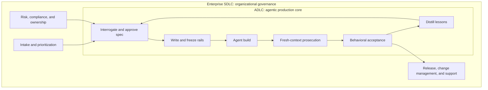
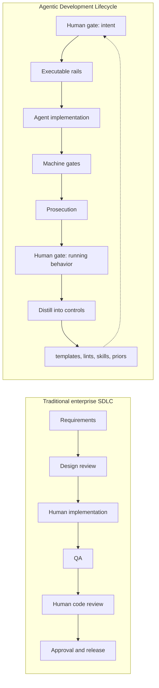
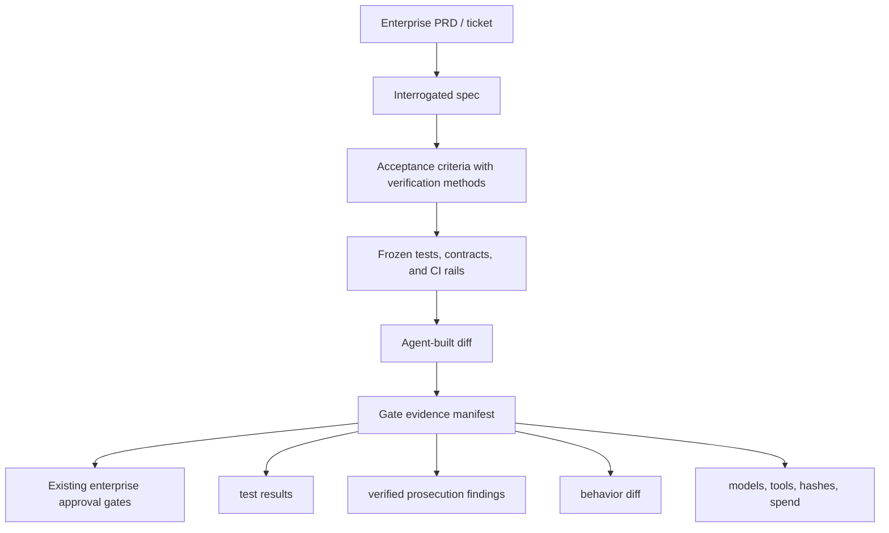
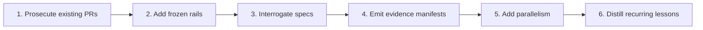

# ADLC vs. the Enterprise SDLC

This series makes a deliberately sharp claim: do not run a human-shaped software development lifecycle on non-human builders. Models fail differently, so the lifecycle around them has to be built from a different flaw inventory — and [the previous post](./08-the-gates-didnt-hold.md) showed what happens when even the lifecycle's own toolkit drifts back to human-shaped assumptions.

That does not mean the enterprise SDLC was stupid. It means it was optimized for a different machine.

The traditional enterprise software development lifecycle is a control system around human teams operating in expensive coordination environments. Its rituals are not random: intake, requirements, design review, implementation, QA, security review, change approval, release management, incident review. Each exists because at enterprise scale, software is not just code. It is risk transfer, budget allocation, auditability, ownership, compliance, support, and organizational memory.

The Agentic Development Lifecycle does not remove those needs. It changes where the expensive human attention goes, what gets automated, and which artifacts become load-bearing.

So the useful question is not "ADLC or SDLC?" It is: **which parts of the SDLC are still defending real enterprise risk, and which parts are only compensating for human labor constraints that agents no longer have?**

The boundary looks like this:

## The traditional enterprise SDLC, stated generously

A good enterprise SDLC does five jobs.

**It clarifies intent.** Product requirements, architecture documents, design reviews, and stakeholder sign-off exist because "build the thing" is almost never enough. Enterprises carry latent requirements: regulatory rules, support obligations, data retention, localization, procurement constraints, SSO, accessibility, observability, rollback, and the one integration owned by a team two divisions away.

**It allocates accountability.** Human owners sign off because the organization needs someone answerable for decisions. A release that breaks revenue recognition or leaks customer data cannot be explained by "the workflow passed." Someone accepted the risk.

**It controls change.** CABs, release windows, QA gates, test plans, and deployment checklists are crude in the small and necessary in the large. They coordinate shared infrastructure and protect customers from surprise.

**It preserves memory.** Tickets, design docs, ADRs, runbooks, postmortems, and test plans are how a company remembers why the system is shaped the way it is after the humans rotate.

**It satisfies external trust.** Auditors, regulators, customers, insurers, and internal risk teams need evidence that controls exist and were followed. The artifact trail is part of the product.

That is the steelman. The SDLC is not just waterfall in a tie. It is an organizational risk machine.

But it is also a machine full of assumptions about human throughput. Humans are slow to build, expensive to rework, limited in parallelism, socially fragile in review, and bad at preserving state without process. The SDLC evolved around those constraints. Agents change enough of them that a direct transplant becomes wasteful at best and dangerous at worst.

## Where ADLC diverges

The enterprise SDLC usually treats implementation as the scarce center of the process. Requirements are negotiated up front because building the wrong thing is expensive. Design review happens before implementation because rework is expensive. QA trails implementation because humans need time to finish a coherent unit of work. Code review sits after the diff because another human has to inspect what the first human wrote.

ADLC inverts that cost structure.

Implementation is no longer the expensive center. **Misbuilding is.** The model can produce a large diff quickly, but it can also produce the wrong large diff quickly, backed by a confident self-report and a green suite it quietly weakened unless the rails were protected. So ADLC spends heavily at the edges: spec interrogation before build, prosecution after build, distillation after merge. The middle is deliberately cheap because the middle is heavily gated.

In an enterprise SDLC, tests usually verify the implementation. In ADLC, tests are the executable contract the builder is not allowed to edit. That is a different relationship. A human developer can be told "do not weaken the test" and mostly comply because reputation, shame, and review norms exist. A model under gate pressure has no such stabilizers. The control has to move from policy to mechanism: frozen rails, diff proofs, deterministic gates.

In an enterprise SDLC, review is often a social and architectural act: maintainers inspect code, transfer knowledge, enforce style, and catch defects. In ADLC, review becomes prosecution: fresh contexts, narrow lenses, refute charters, verified findings, loop-until-dry. Knowledge transfer cannot be assumed to happen by reading a pull request. It has to be mined into skills, lints, templates, and runbooks after the fact.

In an enterprise SDLC, human approval often appears at many points because the process cannot otherwise prove the intermediate state. ADLC tries to reduce mandatory human approval to the two moments where humans are actually the ground truth: "is this what I meant?" and "is this what I meant, running?" Everything between those moments should produce evidence, not requests for trust.

That is the core divergence: **the SDLC distributes human judgment across the lifecycle; ADLC compresses human judgment around intent and behavior, then replaces intermediate trust with machine-checkable evidence.**

## The advantages of ADLC

The first advantage is throughput under control. Agents can build, retry, review, and refactor faster than human teams can coordinate the same work. But raw speed is not the point. Raw speed without gates is just faster incident creation. ADLC's advantage is speed bounded by rails: small tasks, deterministic checks, fresh-context review, and evidence manifests that travel with the change.

The second advantage is review depth. Human review attention collapses on very large diffs. An enterprise can pretend otherwise, but the 5,000-line pull request is rarely read with meaningful recall. ADLC attacks that with parallel prosecution lenses and verification. It does not ask one tired reviewer to notice everything. It decomposes review into repeatable searches, measures recall with planted bugs, and reruns until the stack comes up dry.

The third advantage is economic compounding. A traditional SDLC improves when people learn, but that learning is lossy: people leave, teams reorganize, conventions drift, postmortems decay. ADLC has no implicit memory, so it must make memory explicit. Verified findings become lint rules, skill files, spec questions, prosecution lenses, and routing priors. If the distillation loop works, the same class of issue gets cheaper every time until it disappears into a deterministic gate.

The fourth advantage is better use of senior humans. Enterprise SDLCs often spend senior attention on diff reading, meeting attendance, status reconciliation, and late-stage re-explanation. ADLC spends that attention on spec approval, behavioral acceptance, escalation, and control design. That is a more honest use of scarce judgment.

The fifth advantage is auditability, if implemented seriously. A mature ADLC run can produce an evidence chain richer than a traditional ticket: spec hash, rail hash, rails-diff-empty proof, test results, mutation survivors, prosecution verdicts with calibration scores, model and tool versions, cost by phase, and human acceptance. That is not less governable than SDLC evidence. It is potentially more governable because it is produced by the workflow instead of reconstructed after the fact.

## The disadvantages of ADLC

The first disadvantage is ceremony density. ADLC is not "tell the agent to code and go to lunch." Done seriously, it has more mechanical gates than many human teams tolerate today. For trivial work, the full loop is too much. The lifecycle needs routing by risk and blast radius or it will become the same kind of process theater it criticizes.

The second disadvantage is tooling maturity. Enterprises already have SDLC infrastructure: Jira, GitHub, CI, SAST, change management, release approvals, audit exports. ADLC needs new control surfaces: rail freezing, review calibration, ambiguity measurement, model routing, lesson mining, skill invalidation, evidence manifests. Some can be approximated with existing tools. Some are new. Until the tooling is boring, adoption cost is real.

The third disadvantage is cultural legibility. A CAB understands a test report, a security scan, and named human approvers. It may not yet understand "two consecutive dry prosecution passes with 0.82 planted-bug recall." ADLC has to translate its evidence into enterprise control language or it will be treated as clever automation outside the official risk system.

The fourth disadvantage is uneven fit. ADLC is strongest where behavior can be specified, tested, and decomposed. It is weaker for open-ended product discovery, ambiguous UX taste, deep platform migrations, cross-system political negotiation, and architectural bets whose correctness is only visible months later. Those do not become impossible. They require heavier human gates, stronger design alternatives, longer-running validation, and sometimes the old-fashioned serialized senior engineer.

The fifth disadvantage is new failure modes. A bad SDLC wastes time. A bad ADLC can manufacture false confidence at scale. Frozen rails that encode the wrong spec, calibrated reviewers measured on unrealistic bug plants, stale skills loaded into every agent, model-routing priors trained on noisy history, evidence manifests nobody verifies: these are not hypothetical risks. Structure compounds good lessons, but it can also compound bad ones.

## Where the two overlap

The overlap is larger than the rhetoric suggests.

Both lifecycles need requirements. ADLC does not eliminate requirements; it makes them executable. The enterprise PRD becomes interrogated spec plus acceptance criteria plus verification methods.

Both need architecture. ADLC does not eliminate design review; it changes its timing and granularity. Contracts and shared foundations move up front because parallel work depends on them. Deduplication and simplification move after merge because the actual duplication is visible then.

Both need QA. ADLC does not eliminate testing; it makes tests more central. The difference is provenance: rails written from the spec and protected from the builder are not the same thing as tests added by the implementer after the code exists.

Both need security review. ADLC does not replace security with generic model review. It needs explicit security lenses, deterministic scanners, threat-model prompts, planted security bugs for calibration, and escalation to humans for high-risk surfaces.

Both need change management. ADLC still needs release windows, rollback plans, migrations, customer communication, and incident readiness. It can generate better evidence for those gates, but it does not make shared production risk disappear.

Both need human accountability. ADLC can reduce human toil, but it cannot make the model accountable. The human still owns intent, risk acceptance, and final behavioral approval. In regulated environments, that ownership has to remain explicit.

The clean integration pattern is not to replace the enterprise SDLC wholesale. It is to insert ADLC inside the build-and-review portion of the SDLC, then let its evidence feed the existing enterprise gates. The enterprise lifecycle still decides what work is allowed, who owns it, when it ships, and what risk posture is acceptable. ADLC decides how agent-built changes are specified, gated, prosecuted, integrated, and distilled.

## The practical comparison

| Dimension | Traditional enterprise SDLC | Agentic Development Lifecycle |
|-----------|-----------------------------|-------------------------------|
| Primary failure profile | Human coordination, omission, fatigue, politics, knowledge loss | Premature satisfaction, sycophancy, context rot, hallucination, reward hacking |
| Scarce resource | Human implementation time and reviewer attention | Correct specification, reliable gates, calibrated verification |
| Planning posture | Up-front planning reduces expensive human rework | Up-front interrogation prevents cheap but rapid misbuilds |
| Tests | Verify code and support regression confidence | Encode the spec and constrain the builder |
| Review | Human inspection, maintainership, knowledge sharing | Fresh-context prosecution with reproduced findings |
| Parallelism | Limited by team coordination and merge discipline | Limited by partition quality, contracts, and integration throughput |
| Memory | People, docs, tickets, postmortems | Lints, skills, templates, manifests, routing priors, ledgers |
| Human gates | Many approvals across the process | Two default intent gates, plus escalation and enterprise risk gates |
| Audit evidence | Often manually assembled from process artifacts | Generated continuously as gate evidence |
| Main risk | Slow delivery and ritualized approval | False confidence from poorly designed automation |

This table is the honest shape of the trade. ADLC is not "less process." It is a different process, with different controls, aimed at different failure modes.

## The enterprise adoption path

The wrong rollout is to announce that the SDLC is dead and replace it with an agentic lifecycle diagram. Enterprises reject that kind of transplant for good reasons. Too many surrounding controls depend on the existing process.

The right rollout is narrower.

Start with prosecution on existing PRs. It relieves a pain everyone already has: large diffs nobody wants to review. Keep human approval exactly where it is. Add verified findings, not new authority.

Then add rails for agent-authored work. Require spec-derived tests and protect them from the builder. This is the first real trust anchor.

Then add interrogation before substantial agent work. Convert "go build this" into acceptance criteria with verification methods. Human spec approval becomes higher leverage than late diff review.

Then add evidence manifests. Feed the existing SDLC gates with better artifacts: what was promised, what was checked, what changed in behavior, what the review stack is calibrated to catch, what remains outside the gate.

Only then add parallelism and distillation. Fan-out is the reward for partition quality, not the starting move. Lesson mining is the reward for enough verified findings to mine.

The enterprise SDLC does not disappear in this adoption path. It becomes the outer governance shell. ADLC becomes the inner production system for agent-built software.

## The bottom line

The traditional enterprise SDLC asks: **how do we coordinate humans so software changes are intentional, reviewed, tested, approved, and supportable?**

The Agentic Development Lifecycle asks: **how do we constrain probabilistic builders so their speed becomes verified change instead of accelerated ambiguity?**

Those are different questions, and mature organizations need both. The SDLC remains the language of ownership, risk, release, compliance, and institutional accountability. ADLC becomes the language of model-shaped production: executable specs, frozen rails, fresh-context prosecution, measured ambiguity, deterministic gates, and compounding lessons.

The mistake is treating one as a drop-in replacement for the other. The opportunity is cleaner than that: keep the enterprise SDLC where it protects enterprise risk, and replace the human-shaped build-and-review core with an agent-shaped lifecycle that produces stronger evidence than the old core ever did.

That is the comparison in one sentence: **SDLC governs the organization around the change; ADLC governs the machines producing the change.** The overlap is real, the tradeoffs are real, and the boundary between them is where serious agent adoption should start.

*Start of series: [Stop Running the SDLC on Models That Aren't Human →](./01-stop-running-the-sdlc-on-models-that-arent-human.md)*
