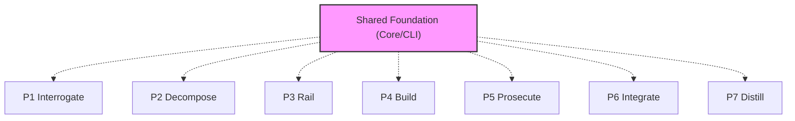

# @adlc/cli

**ADLC Phase:** Shared foundation

### ADLC Lifecycle Context




The umbrella dispatcher for the ADLC suite. It provides one stable command
surface for Codex skills, hooks, CI, and humans:

```sh
adlc <tool> [args...]
adlc run <phase> [args...]
adlc accept [args...]
```

The dispatcher is a router. It adds no behavior to a tool run: argv is forwarded
verbatim and the child exit code is propagated unchanged.

## Why this exists

ADLC packages publish independently, but an agent harness needs a single stable
prefix. A skill or hook that shells out to twenty different binaries is brittle,
slower to document, and easier to route around. `@adlc/cli` installs the suite
and makes every gate reachable through `adlc <tool>`.

## Resolution model

The dispatcher resolves package-local binaries from its own `@adlc/*`
dependencies. It does not search the user's `PATH` for tool names, so stale
global binaries cannot silently satisfy a gate.

## Usage

```sh
adlc --help
adlc --version
adlc spec-lint spec.md --json
adlc rails-guard --ticket T1 --record --json
adlc run p5 --ticket T1 --dir .adlc --json
adlc accept --ticket T1 --packet .adlc/packet.json --dir .adlc --json
```

## Exit codes

Exit codes mirror the underlying tool:

- `0`: gate passes or command succeeds.
- `1`: operational error.
- `2`: gate fails.

Dispatcher-level failures, such as an unknown tool or missing package, exit `1`.

## ADLC phase

Cross-cutting. This is the delivery and invocation layer for the ADLC Codex
integration.
