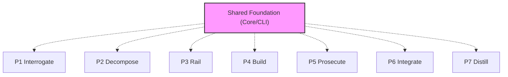

# @adlc/core — FROZEN CONTRACT

**ADLC Phase:** Shared foundation

### ADLC Lifecycle Context




Shared library for all ADLC tools. **This package is frozen during tool
builds (rails).** Tools import from it; tools never modify it. If the API is
insufficient for your tool, work around it inside your own package and note
the gap in your README — do not edit core.

Import surface (from a tool at `packages/<name>/`):

```js
import { complete, fan, fanProviders, extractJson, detectProvider, resolveModel, PROVIDER_NAMES } from '../../core/index.mjs';
import { git, gitDiff, changedFiles, isDirty, isGitRepo, coChange, pairKey, churn } from '../../core/index.mjs';
import { parseArgs, pass, gateFail, opError, printJson, readStdin, promptOnly } from '../../core/index.mjs';
import { ADLC_DIR, appendEntry, readEntries, ledgerPath, sha256, hashFiles } from '../../core/index.mjs';
import { TICKETS_PATH, loadTickets, validateTicket, topoSort, computeFloat, globMatch, inScope, scopesOverlap } from '../../core/index.mjs';
import { mutate } from '../../core/index.mjs'; // mutate.generateMutants / applyMutant / changedLinesFromDiff / OPERATORS
```

## llm

- `detectProvider(env?, forceProvider?)` → `{ name, apiKey, models } | null`. Order: anthropic, openai, gemini, agy. Force with `ADLC_PROVIDER` (env) or the `forceProvider` arg (per-invocation, e.g. a CLI `--provider` flag — takes precedence over `ADLC_PROVIDER`).
- `PROVIDER_NAMES` → `['anthropic', 'openai', 'gemini', 'agy']`, for CLI validation of `--provider`/`--providers`.
- `resolveModel(provider, { tier, model }, env?)` → model id. Tiers: `cheap | mid | frontier`. Override via `ADLC_MODEL_CHEAP/MID/FRONTIER`.
- `complete({ tier, model, system, prompt, maxTokens, provider? }, env?)` → `Promise<string>`. Throws if no provider (tools must catch and offer `--prompt-only`). `provider` is a per-invocation override, additive only — omit it and single-provider auto-detect remains the default (cost/latency per ADR-0007).
- `fan(opts, n, env?)` → `Promise<[{ ok, value | error }]>` — n independent stateless completions of the SAME (auto-detected or `opts.provider`-forced) provider.
- `fanProviders(opts, providerNames, env?)` → `Promise<[{ ok, value | error, provider }]>` — one completion per DISTINCT named provider (e.g. `['anthropic', 'openai', 'gemini']`), instead of N resamples of one provider. A named provider missing its API key surfaces as `{ ok: false }` for that entry only.
- `extractJson(text)` → parsed JSON value from messy model output. Throws if none.

## git

- `git(args[], opts?)` → stdout string (execFileSync; throws on non-zero).
- `isGitRepo(cwd?)`, `gitDiff(base?, cwd?)`, `changedFiles(base?, cwd?)`, `isDirty(cwd?)`.
- `coChange(limit?, cwd?)` → `{ pairCounts: {'a b': n}, fileCounts }` (logical coupling; commits touching >50 files skipped). Pair keys via `pairKey(a, b)` (sorted).
- `churn(limit?, cwd?)` → `{ file: commitCount }`.

## cli

- `parseArgs(config)` — node:util parseArgs with `allowPositionals: true` default.
- `pass(msg?)` exit 0 · `gateFail(msg, details?)` exit 2 · `opError(msg)` exit 1.
- `printJson(obj)`, `readStdin()`, `promptOnly(promptOrArray)` (print prompt(s), exit 0).

**Exit codes are the contract: 0 = gate passes, 1 = operational error, 2 = gate fails.**

## ledger (persistence at `.adlc/`)

- `appendEntry(name, entry, dir?)` → appends to `.adlc/<name>.jsonl`.
- `readEntries(name, dir?)` → `{ entries, skipped }` — malformed lines reported, never swallowed.
- `sha256(content)`, `hashFiles(paths)` → `{ path: hash | null }`.

Well-known ledger names: `manifest` (gate-manifest entries), `findings`
(prosecution findings: `{ ts, tool, file, line, category, severity, desc, verdict }`).

## tickets (`.adlc/tickets.json`)

Schema (see lib/tickets.mjs header): `{ id, title, body, scope[], rails[], edges[{to, contract}], duration, category, budget }`.

- `loadTickets(path?)` → `{ tickets, errors }` (validates ids, duplicate ids, unknown edges).
- `validateTicket(t)` → `errors[]`.
- `topoSort(tickets)` → `{ order, cycle | null }`. Edges mean "completes before edge.to".
- `computeFloat(tickets)` → `{ floats: {id: n}, criticalPath: [ids], makespan }` (CPM; duration default 1) or `{ error }` on cycle.
- `globMatch(pattern, path)` (`*`, `**`), `inScope(ticket, path)`, `scopesOverlap(a, b)` (conservative).

## mutate

- `mutate.OPERATORS` — invert-comparison, bool-flip, null-return, off-by-one, logic-swap.
- `mutate.generateMutants(content, { targetLines?, maxMutants? })` → `[{ line, operator, original, mutated }]` (skips comments/imports/console lines).
- `mutate.applyMutant(content, mutant)` → mutated content (throws if line content drifted).
- `mutate.changedLinesFromDiff(diffText)` → `{ file: Set<newSideLineNo> }`.
