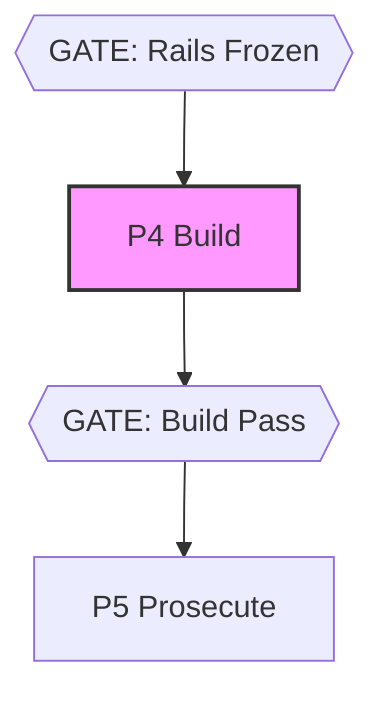

# flail-detector

**ADLC Phase:** P4 Build

### ADLC Lifecycle Context




Session-log flail analysis — mechanical two-strike rule. ADLC phase **C6 / P4 supervisor**.

Watches a build session log for flail signatures. On trigger: emits verdict
`flail`, prints a recommendation block, and exits 2 so CI can gate. Fully
deterministic; no LLM calls.

## Usage

```
flail-detector <log-file> [--scope <glob>...] [--max-repeat <n>] [--max-bytes <n>] [--spent-tokens <n>] [--budget <n>] [--record] [--ticket <id>] [--json]
```

### Arguments

| Argument | Description |
|----------|-------------|
| `<log-file>` | Path to the session log file to analyze (required) |

### Flags

| Flag | Default | Description |
|------|---------|-------------|
| `--scope <glob>` | _(none)_ | Declared-scope glob pattern (repeatable). When given, file paths found in tool-log lines that fall outside ALL supplied globs are flagged as **scope violations**. |
| `--max-repeat <n>` | `2` | Trigger the **repeated-error** signal when a normalized error signature appears >= n times. |
| `--max-bytes <n>` | _(no limit)_ | Trigger the **size** signal when the log file exceeds n bytes. |
| `--spent-tokens <n>` | _(none)_ | Measured token spend for this ticket (e.g. from `adlc spend --ticket <id> --json`). Must be given with `--budget`. |
| `--budget <n>` | _(none)_ | The ticket's declared token budget (`ticket.budget`, or `model-router`'s emitted per-ticket `budget`). Triggers the **budget** signal when `--spent-tokens` exceeds it. Must be given with `--spent-tokens` — either alone is a usage error. |
| `--record` | off | On a clean verdict, append a `flail-check` entry to `.adlc/manifest.jsonl` (ADLC P4 evidence — see [`runner`](./runner.md)). Never writes on a `flail` verdict, and never on a `could-not-analyze` outcome (issue #622). |
| `--ticket <id>` | _(none)_ | Ticket to scope the recorded manifest entry to. Optional — recorded as `null` when omitted, same as [`rails-guard --record`](./rails-guard.md). |
| `--json` | off | Machine-readable JSON output for orchestrators. |
| `--help` | — | Print help and exit 0. |

## Exit Codes

| Code | Meaning |
|------|---------|
| `0` | Gate passes — no flail signals detected (clean) |
| `1` | Operational error — file not found, bad argument, or **`could-not-analyze`**: the log had nothing to analyze (no non-empty lines). Never a pass — nothing is recorded even with `--record`. |
| `2` | Gate fails — one or more flail signals triggered |

## Signals

### 1. repeated-error

Lines matching `/error|exception|failed|cannot|ENOENT/i` are normalized
(lowercase; strip digits, hex literals, quoted strings, and absolute paths),
then counted per unique signature. Any signature occurring >= `--max-repeat`
times triggers this signal.

**Normalization** ensures that `Error: cannot find module "lodash" at line 42`
and `Error: cannot find module "express" at line 99` collapse to the same
signature — the error kind is what matters, not the varying operands.

### 2. scope-violation

Only active when `--scope` is given. File paths extracted from common
tool-log patterns:

- `Writing <path>`
- `Editing <path>`
- `Created <path>`
- `"file_path":"<path>"` (JSON tool-log format)

Any path that does not match at least one `--scope` glob is a violation.

### 3. edit-churn

The same file path appearing in >= 3 write/edit log lines (regardless of
which verb — Writing, Editing, or Created). Indicates the agent is cycling
back to the same file repeatedly.

### 4. size

When `--max-bytes` is given, triggers if the log file byte count exceeds the
threshold.

### 5. budget

When both `--spent-tokens` and `--budget` are given, triggers if measured
spend exceeds the ticket's declared ceiling — ADLC.md C6's "token spend past
the ticket budget" trigger, made real (issue #275). Neither figure comes from
the log itself: `flail-detector` doesn't measure tokens, it only compares two
numbers the caller supplies. Pair with [`adlc spend`](./spend.md) for the
measured side and [`model-router`](./model-router.md)'s emitted `budget` (or
the ticket's own declared `budget` field) for the ceiling. Giving only one of
the two flags is a usage error (exit 1) rather than a silent no-op — a
half-specified budget check is worse than none.

## Input Handling

If more than half the non-empty lines of the log parse as JSON objects, the
file is treated as **JSONL**: string values of the keys `content`, `text`, and
`message` are recursively extracted and fed into the signal detectors. All
other files are treated as **plain text**, one line at a time.

## Output

Human-readable (default):

```
flail-detector: FLAIL
  bytes: 361
  signals:
    repeated-error (1 signature(s)):
      [2x] error: cannot resolve module at line in
    scope-violation (1 path(s) outside scope):
      /etc/hosts
    edit-churn (1 file(s) edited >= 3 times):
      [3x] src/index.ts

  recommendation:
    Kill the session. Append these dead-ends to the ticket: error: cannot resolve module at line in
```

Machine-readable (`--json`):

```json
{
  "verdict": "flail",
  "signals": [...],
  "bytes": 361,
  "recommendation": "Kill the session. Append these dead-ends to the ticket: ..."
}
```

When the log has nothing to analyze — it is empty or whitespace-only — the
verdict is `could-not-analyze` and the exit code is 1, not 0:

```json
{
  "verdict": "could-not-analyze",
  "reasons": ["log has no non-empty lines (empty or whitespace-only file)"],
  "bytes": 0,
  "signals": []
}
```

In text mode the same outcome prints `flail-detector: could not analyze — <reasons>`
to stderr. It is an operational outcome, never a pass: a supervisor pointed at a log
path that was never written must not get a green P4 gate, and `--record` writes no
`flail-check` entry for it (issue #622).

Scope is deliberately not part of this decision: a well-behaved session may contain
no writes at all, and supervisors such as `@adlc/fleet` pass the ticket's `--scope`
on every consult — so a log with lines but no extractable file path is analyzed
normally (repeated-error, size and budget signals still fire; the scope signals
simply have nothing to flag). Under-extraction of paths from real logs is issue
#623's domain.

## Examples

```bash
# Analyze a plain-text session log
flail-detector session.log

# Enforce scope (write/edit must stay inside src/ or test/)
flail-detector session.log --scope 'src/**' --scope 'test/**'

# Raise the error-repeat threshold to 3
flail-detector session.log --max-repeat 3

# Flag oversized logs (e.g. > 1 MB context)
flail-detector session.log --max-bytes 1048576

# Flag token spend past the ticket's declared budget
flail-detector session.log --spent-tokens 85000 --budget 50000

# JSON for orchestrators
flail-detector session.log --json

# Record P4 evidence on a clean pass (adlc run p4 requires this)
flail-detector session.log --scope 'src/**' --record --ticket T42
```

## ADLC Phase

**C6 / P4 supervisor.** Encodes the two-strike regeneration rule mechanically.
See ADLC.md §C6 for the design rationale.

Intended to be invoked by a P4 supervisor after each build attempt. On `flail`
(exit 2): kill the session, append the dead-end signatures to the ticket, and
regenerate fresh. On second trigger: escalate to P2 — the ticket is wrong, not
the agent.

## Relationship to Sibling Tools

- **rails-guard (C5)**: enforces frozen rails on git diffs; flail-detector
  watches live session logs for behavioral drift.
- **consensus-fix (C7)**: fan-out fix strategy invoked after flail is
  confirmed; flail-detector is the upstream gate that triggers it.
- **premortem (C2)**: upstream risk analysis; flail-detector catches the
  risk materializing at runtime.

## Core Gaps

None. This tool uses only `parseArgs`, `opError`, `printJson`, `sha256`, `pass`,
`gateFail`, and `globMatch` from `@adlc/core`. No LLM, no git. `--record` is the
one ledger write this tool performs, via `@adlc/gate-manifest`'s
`appendManifestEntry`, mirroring `rails-guard`'s `--record` (issue #106) —
without it, `adlc run p4`'s `flail-check` requirement could never be satisfied
by any documented flow.
