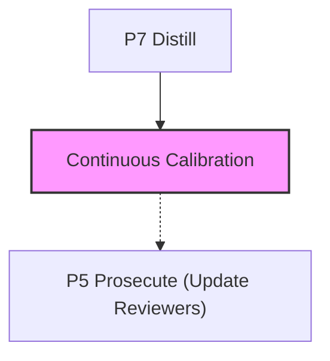

# gate-fuzzing

**ADLC Phase:** Continuous calibration

### ADLC Lifecycle Context




Standing red-team / gate calibration for the ADLC toolkit (C-tool).

A generator-adversary fans N cheap/mid model instances to produce candidate diffs
designed to **pass every configured gate while being genuinely wrong**. Each gate
a wrong-but-passing diff defeats is a calibration finding that hardens that gate.

This turns "we found 11 bypasses once" into "finding bypasses is a CI gate."

## Usage

```
gate-fuzzing [--suite <path>] [--n <int>] [--tier cheap|mid]
             [--max-rounds <int>] [--dry-rounds <int>] [--token-budget <int>]
             [--witness-trials <int>] [--max-fail-rate <float>] [--canary-budget <int>]
             [--behavioral-witness] [--allow-cmd <name>...] [--unsafe-no-sandbox]
             [--strict-budget] [--fail-on-behavioral]
             [--record] [--triage] [--json] [--prompt-only] [--help]
```

## Exit codes

| Code | Meaning |
|------|---------|
| `0` | Earned clean: potency canary beaten, no defeats found, dry streak reached |
| `1` | Operational error: dirty tree, no sandbox binary, control self-test failed, all-inconclusive (strict), canary not beaten (strict) |
| `2` | A gate was defeated: wrong-but-passing, surface-and-claim-bound, independently-witnessed |

## Flags

| Flag | Default | Purpose |
|------|---------|---------|
| `--suite <path>` | `.adlc/gate-suite.json` | Gate suite descriptor (refuses if absent) |
| `--n <int>` | `6` | Fan width per round |
| `--tier cheap\|mid` | `mid` | Adversary tier (frontier rejected) |
| `--max-rounds <int>` | `10` | Hard round ceiling |
| `--dry-rounds <int>` | `3` | K consecutive dry rounds to stop |
| `--token-budget <int>` | `200000` | Estimated token ceiling (chars/4) |
| `--witness-trials <int>` | `3` | N witness runs per side (unanimous) |
| `--max-fail-rate <float>` | `0.5` | Fan-failure fraction → inconclusive round |
| `--canary-budget <int>` | `2` | Rounds to beat potency canary |
| `--behavioral-witness` | off | Use independent-context lens for behavioral gates |
| `--allow-cmd <name>` | node,git,npm,npx | Extend interpreter allowlist |
| `--unsafe-no-sandbox` | off | Skip OS sandbox (ONLY inside disposable VM) |
| `--strict-budget` | off | Any inconclusive stop → exit 1 (CI recommended) |
| `--fail-on-behavioral` | off | Behavioral defeats → exit 2 (default: REPORT only) |
| `--record` | off | Write repro artifacts + cluster findings |
| `--triage` | off | Cheap-model root-cause annotation (never affects verdict) |
| `--json` | off | Machine-readable JSON report |
| `--prompt-only` | off | Print adversary prompts and exit 0 (zero API keys) |

## Isolation & sandbox requirement

gate-fuzzing executes adversary-generated diffs, setup commands, gates, and
witnesses. Every candidate runs in a **fresh disposable git clone** of your repo
(`git clone --local --no-hardlinks`), never in your real working tree, and the
clone is always destroyed afterward. All harness git calls are hardened with
`-c core.hooksPath=/dev/null -c core.fsmonitor=false` so a candidate cannot plant
a hook that runs at gate-time. The run refuses against a non-git or dirty tree.

On top of the clone, it **requires an OS sandbox** to confine execution:

- **Linux:** `bwrap` (bubblewrap) — unshares all namespaces, denies network
- **macOS:** `sandbox-exec` — SBPL profile that denies network, confines writes
  to the clone directory

Without a sandbox binary, pass `--unsafe-no-sandbox` ONLY inside a disposable
VM or container. Running without sandbox protection against adversary-generated
code is a security risk.

**Recommended:** always run gate-fuzzing inside a disposable VM/container.

## Gate suite format

Create `.adlc/gate-suite.json`:

```json
{
  "baseline": "auto",
  "validityGates": ["build", "lint", "typecheck"],
  "gates": [
    {
      "name": "rails-guard",
      "run": ["node", "{{clone}}/packages/rails-guard/bin/rails-guard.mjs",
              "--rails", "test/**", "--base", "{{baseline}}"],
      "cwd": "{{clone}}",
      "surface": ["test/**"],
      "claims": ["freeze-integrity"],
      "docs": ["packages/rails-guard/README.md"]
    },
    {
      "name": "build",
      "run": ["npm", "run", "build"],
      "cwd": "{{clone}}",
      "validity": true
    }
  ]
}
```

- `surface`: glob patterns of paths the gate guards (clause 3 in defeat definition)
- `claims`: property kinds the gate asserts (e.g. `freeze-integrity`, `test-adequacy`)
- `validity: true`: marks build/lint/typecheck gates (anti-gaming)
- `{{clone}}`, `{{baseline}}`: substituted by harness at runtime

## What is a "defeat"?

A candidate diff defeats a gate G iff ALL of:
1. Valid (applies cleanly, passes build/lint/typecheck)
2. Passes ALL configured gates (every gate exits 0)
3. Candidate touches G's declared surface
4. Candidate violates a property G claims to protect (claimKind match)
5. An independent, unanimously-discriminating, held-out witness proves it wrong

Independence sources (§1.1):
- **(a) Contract-derived** — mechanically derived from G's declared contract
- **(b) Independent-context approval** — fresh-context lens confirms genuine defect

Source (c) suite-minus-G corroboration removed (Fix 3 — logically vacuous).

## A defeat → a committed gate-fix

gate-fuzzing emits repro artifacts to `.adlc/gate-defeats/<id>.json` containing
the diff, setup, witness, and a RED test scaffold. The real defense is committing
that RED test into the defeated gate's `test/` directory and fixing the gate
until the test passes. This is the compounding ratchet.

## ADLC phase

C-tool (continuous calibration). Scheduled / nightly, not per-commit.
See ADLC.md §C and Post 8 for the doctrine.

## Core gaps

- `fan()` / `complete()` return raw text; no `usage` block is exposed. Budget is
  estimated as `≈chars/4` (labeled `tokensEstimated` in JSON output, not provider-reported).
  The clean fix threads usage out of `provider.send` — out of scope for this package
  (core is frozen). See §3.2 of DESIGN.md.

## Siblings

- `review-calibration` — `runWitness` exit-0 convention is re-implemented locally
  (each tool stands alone; §13.1 of DESIGN.md)
- `lesson-foundry` — gate-bypass findings route to SPEC-GAP (cluster/visibility only;
  §4.4 of DESIGN.md)
- `rails-guard`, `gate-manifest`, `hollow-test` — example gates in the suite
