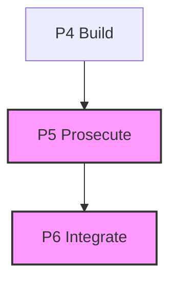

# gate-manifest

**ADLC Phase:** P5/P6 Prosecute/Integrate

### ADLC Lifecycle Context




**ADLC C11 — cross-cutting provenance.** A hash-chained evidence ledger that records what each ADLC gate verified, proving to auditors (and CI) that agentic code was checked before it shipped. Set `ADLC_MANIFEST_KEY` to add HMAC-SHA256 signatures so the chain attests *authorship*, not just internal consistency (see [Signing & provenance](#signing--provenance)).

## ADLC phase

Serves **C11** (cross-cutting provenance / agentic SLSA). Consumed by **P6 human-gate** reviewers who need `attest` output as a PR comment, and by **CI** which runs `verify` as a blocking gate.

## Usage

```
gate-manifest record <gate-name> [--ticket id] [--data '{json}'] [--files a,b,c] [--dir path] [--json]
gate-manifest verify [--json] [--dir path]
gate-manifest show   [--ticket id] [--json] [--dir path]
gate-manifest attest [--ticket id] [--dir path]
```

### record

Append one entry to `.adlc/manifest.jsonl`.

```sh
gate-manifest record spec-lint --ticket T-42 --data '{"model":"haiku","pass":true}' --files src/foo.mjs,src/bar.mjs
```

The entry stored:

```json
{
  "seq": 3,
  "gate": "spec-lint",
  "ticket": "T-42",
  "ts": "2024-01-01T00:00:00.000Z",
  "data": { "model": "haiku", "pass": true },
  "files": { "src/foo.mjs": "<sha256>", "src/bar.mjs": "<sha256>" },
  "prev": "<sha256 of the previous raw JSONL line, or null>",
  "sig": "<HMAC-SHA256 over the canonical entry bytes — present only when ADLC_MANIFEST_KEY is set>"
}
```

When `ADLC_MANIFEST_KEY` is set, `record` appends a `sig` (the human output prints `(signed)` / `(unsigned)`). See **Signing & provenance** below.

| Flag | Description |
|------|-------------|
| `--ticket id` | Associate this entry with a ticket id (optional) |
| `--data '{json}'` | Arbitrary JSON payload (must be valid JSON; malformed → exit 1) |
| `--files a,b,c` | Comma-separated paths; each is SHA-256 hashed (missing files hash to null) |
| `--dir path` | Override ledger directory (default `.adlc`) |
| `--json` | Print the recorded entry as JSON |

### verify

Walk the raw ledger lines and validate the hash chain. Every entry's `prev` must equal `sha256` of the exact raw bytes of the previous line; sequence numbers must be strictly monotonically increasing.

```sh
gate-manifest verify          # human-readable
gate-manifest verify --json   # machine-readable
```

**Exit 0** when valid (or empty manifest). **Exit 2** when the chain is broken — reports the seq and line number of the first break.

When `ADLC_MANIFEST_KEY` is set, `verify` additionally checks every entry's HMAC signature. A missing sig (`unsigned entry`) or a wrong sig (`signature invalid`) breaks the chain. The JSON result includes `signed: true` only when a key was present and every entry verified cryptographically; otherwise `signed: false`.

| Flag | Description |
|------|-------------|
| `--json` | Emit `{ valid, message, count, signed, break }` |
| `--dir path` | Override ledger directory |

### show

Print entries from the ledger, optionally filtered by ticket.

```sh
gate-manifest show
gate-manifest show --ticket T-42
gate-manifest show --ticket T-42 --json
```

| Flag | Description |
|------|-------------|
| `--ticket id` | Filter to entries with this ticket id |
| `--json` | Emit `{ entries, skipped }` |
| `--dir path` | Override ledger directory |

### attest

Generate a Markdown summary suitable for a PR comment.

```sh
gate-manifest attest --ticket T-42
```

Output example:

```markdown
## Gate evidence for T-42

| seq | gate | ts | files | data |
|-----|------|-----|-------|------|
| 1 | spec-lint | 2024-01-01T… | 0 | — |
| 2 | hollow-test | 2024-01-01T… | 3 | model=haiku |

Chain status: **valid** (2 entries)
```

| Flag | Description |
|------|-------------|
| `--ticket id` | Filter entries and use ticket id in heading |
| `--dir path` | Override ledger directory |

## Exit codes

| Code | Meaning |
|------|---------|
| 0 | Gate passes (record, show, attest always; verify when chain is valid) |
| 1 | Operational error (bad input, unreadable file, malformed `--data` JSON) |
| 2 | Gate fails (verify detects chain break) |

## Chain integrity

`record` reads the ledger file via `readFileSync` (raw bytes) — never via `readEntries` which re-serialises and would lose byte-exact fidelity. The `prev` field is `sha256(previous raw JSONL line)` (null for the first entry). Tampering any middle line breaks all subsequent `prev` hashes, detected by `verify`.

## Signing & provenance

The hash chain alone proves **internal consistency**, not **authorship**. `sha256` is a public, keyless function: anyone who can write `manifest.jsonl` can recompute every `prev` and forge a clean chain from scratch. On its own the chain is therefore *not* cryptographic provenance — do not represent a hash-chain-only pass as in-toto/SLSA attestation.

To get real provenance, set a secret signing key:

```sh
export ADLC_MANIFEST_KEY="$(openssl rand -hex 32)"   # store in your CI secret manager, never in the repo
gate-manifest record spec-lint --ticket T-42
gate-manifest verify --json    # → { ..., "signed": true }
```

- **record** computes `sig = HMAC-SHA256(key, canonicalEntryBytes)`. The signed bytes are the deterministic JSON of `{ seq, gate, ts, ticket?, data?, files, prev }` in that fixed key order (optional `ticket`/`data` included only when present), **excluding** `sig` itself. `sig` is appended last.
- **verify** (run with the key) requires every entry to carry a valid sig — comparison is constant-time (`crypto.timingSafeEqual`). A missing sig → `unsigned entry`; a wrong sig → `signature invalid`. Either breaks the chain (exit 2). This defeats the forge-from-scratch attack: without the key, an attacker cannot produce valid signatures.
- **verify** without a key still checks the hash chain but reports `signed: false`, so callers cannot claim cryptographic provenance.

Zero-dependency: HMAC comes from Node's built-in `node:crypto`. Key management (rotation, distribution) is out of scope for this tool — supply the key via the environment.

## Sibling tools

- `rails-guard` (C5) — appends its own proof here after verifying diff is rails-clean.
- `hollow-test` (C4) — appends coverage and mutation results.
- `review-calibration` (C8) — appends prosecution verdicts and calibration score.

## Core gaps

None for ledger/CLI primitives — `sha256`, `hashFiles`, `appendEntry`, `readEntries`, `ledgerPath`, `ADLC_DIR`, `parseArgs`, `pass`, `gateFail`, `opError`, `printJson` from `@adlc/core` cover them. Core exposes `sha256` but no keyed-MAC primitive, so HMAC signing uses Node's built-in `node:crypto` (`createHmac`, `timingSafeEqual`) directly in `lib/sign.mjs` — still zero runtime dependencies.
