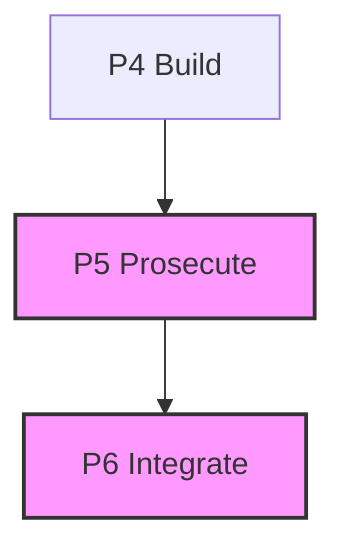

# gate-manifest

**ADLC Phase:** P5/P6 Prosecute/Integrate

### ADLC Lifecycle Context


```mermaid
flowchart TD
    P4["P4 Build"] --> P5["P5 Prosecute"]
    P5 --> P6["P6 Integrate"]
    style P5 fill:#f9f,stroke:#333,stroke-width:2px
    style P6 fill:#f9f,stroke:#333,stroke-width:2px
```


**ADLC C11 — cross-cutting provenance.** A hash-chained evidence ledger that records what each ADLC gate verified, proving to auditors (and CI) that agentic code was checked before it shipped. Set `ADLC_MANIFEST_KEY` to add HMAC-SHA256 signatures so the chain attests *authorship*, not just internal consistency (see [Signing & provenance](#signing--provenance)).

## ADLC phase

Serves **C11** (cross-cutting provenance / agentic SLSA). Consumed by **P6 human-gate** reviewers who need `attest` output as a PR comment, and by **CI** which runs `verify` as a blocking gate.

## Usage

```
gate-manifest record <gate-name> [--ticket id] [--data '{json}'] [--files a,b,c] [--dir path] [--json]
gate-manifest verify [--json] [--dir path] [--allow-legacy-unsigned]
gate-manifest show   [--ticket id] [--json] [--dir path]
gate-manifest attest [--ticket id] [--dir path]
gate-manifest repair-chain --reason "..." [--write] [--attest-unsigned] [--json] [--dir path]
gate-manifest enable [--write] [--json] [--dir path] [--allow-keyless]
gate-manifest adopt  [<segment>] [--write] [--json] [--dir path]
```

Prosecution, runner acceptance, rails evidence, and manual gate records use the
same atomic chain writer. `repair-chain` recovers ledgers made
by older raw appenders: it refuses valid ledgers, preserves the original bytes
in a hash-named backup, rechains entries in order, and records the repair as the
final entry. Signed ledgers require the original matching `ADLC_MANIFEST_KEY`;
repair verifies every existing signature before it rewrites anything. If keyed
repair would sign previously unsigned entries, it refuses unless the operator
passes `--attest-unsigned`; the repair plan and audit entry disclose their count
and original line numbers.

### record

Append one entry to `.adlc/manifest.jsonl`.

```sh
gate-manifest record spec-lint --ticket T-42 --data '{"model":"haiku","pass":true}' --files src/foo.mjs,src/bar.mjs
```

The entry stored:

```json
{
  "seq": 3,
  "gate": "spec-lint",
  "ticket": "T-42",
  "ts": "2024-01-01T00:00:00.000Z",
  "data": { "model": "haiku", "pass": true },
  "files": { "src/foo.mjs": "<sha256>", "src/bar.mjs": "<sha256>" },
  "prev": "<sha256 of the previous raw JSONL line, or null>",
  "sig": "<HMAC-SHA256 over the canonical entry bytes — present only when ADLC_MANIFEST_KEY is set>"
}
```

When `ADLC_MANIFEST_KEY` is set, `record` appends a `sig` (the human output prints `(signed)` / `(unsigned)`). See **Signing & provenance** below.

| Flag | Description |
|------|-------------|
| `--ticket id` | Associate this entry with a ticket id (optional) |
| `--data '{json}'` | Arbitrary JSON payload (must be valid JSON; malformed → exit 1) |
| `--files a,b,c` | Comma-separated paths; each is SHA-256 hashed (missing files hash to null) |
| `--dir path` | Override ledger directory (default `.adlc`) |
| `--json` | Print the recorded entry as JSON |

### verify

Walk the raw ledger lines and validate the hash chain. Every entry's `prev` must equal `sha256` of the exact raw bytes of the previous line; sequence numbers must be strictly monotonically increasing.

```sh
gate-manifest verify                            # human-readable
gate-manifest verify --json                      # machine-readable
gate-manifest verify --allow-legacy-unsigned      # tolerate an honest pre-signing prefix
```

**Exit 0** when valid (or empty manifest). **Exit 2** when the chain is broken — reports the seq and line number of the first break.

When `ADLC_MANIFEST_KEY` is set, `verify` additionally checks every entry's HMAC signature. By default every entry must carry a valid sig: a missing sig (`unsigned entry`) or a wrong sig (`signature invalid`) breaks the chain. The JSON result includes `signed: true` only when a key was present and every entry verified cryptographically; otherwise `signed: false`.

`--allow-legacy-unsigned` relaxes the missing-sig requirement, but only for a **contiguous legacy prefix**: entries before the first entry in the file that carries a sig (i.e. entries recorded before this ledger ever adopted signing). As soon as the scan passes that first signed entry, every later entry is "signed-era" and a missing sig on it still breaks the chain — an attacker cannot regress a signed ledger back to unsigned by appending plain entries after the fact. A **present-but-invalid** signature is rejected everywhere, at any position, with or without this flag — this only tolerates an honest unsigned history, never a tampered one. Use this flag for routine health checks (e.g. a Stop hook) on a ledger that predates signing; omit it when you specifically want to prove the whole chain is under key control (e.g. a forge-from-scratch check).

Honest limit: if a manifest has **zero** signed entries, this flag reports the whole file as a valid legacy prefix — a wholesale-forged, entirely-unsigned chain is indistinguishable from a ledger that genuinely predates signing end to end (sha256 is public and keyless; forging it needs no secret). `signed` stays `false` in both cases, so it cannot be used to tell them apart. A caller that needs a stronger guarantee (proof that at least one entry is under key control) must check for that itself.

| Flag | Description |
|------|-------------|
| `--json` | Emit `{ valid, message, count, signed, break }` |
| `--dir path` | Override ledger directory |
| `--allow-legacy-unsigned` | Tolerate a missing sig on the contiguous legacy prefix only |

### show

Print entries from the ledger, optionally filtered by ticket.

```sh
gate-manifest show
gate-manifest show --ticket T-42
gate-manifest show --ticket T-42 --json
```

| Flag | Description |
|------|-------------|
| `--ticket id` | Filter to entries with this ticket id |
| `--json` | Emit `{ entries, skipped }` |
| `--dir path` | Override ledger directory |

### enable

Switch a repository with **no recorded evidence** into segmented (forest)
mode by writing the `.adlc/manifest.d/.store.json` activation marker. Both
storage modes are permanent and supported (spec §1.1) — run this only for
repositories doing parallel worktree fan-out, where concurrent branches
conflict on the single file's tail.

```sh
gate-manifest enable          # dry-run: prints the plan, writes nothing
gate-manifest enable --write  # writes the marker atomically
```

Activation without `ADLC_MANIFEST_KEY` refuses unless `--allow-keyless` is
passed: keyless-minted segments can never be authenticated by a key added
later, so keyless forest mode is single-checkout only, permanently — a
deliberate opt-in, never a stumble. Re-running `enable` on an already-enabled
repository re-checks the gitignore contract as a health check and exits `2`
if ignore rules have drifted (e.g. `.lineage` became trackable).

Dry-run by default. Exit `0` on a written or already-enabled repo (a
cutover-tailed root counts as enabled even if its marker was lost). Exit `2`,
writing nothing, when:

- there is no `.adlc/` workspace (run `adlc init` first — enable never
  creates one as a side effect);
- the root `manifest.jsonl` already records evidence — history-preserving
  migration is the cutover ceremony (T-MANIFEST-FOREST-MIGRATE), not
  greenfield enable;
- `manifest.d/` has content but no valid marker (a broken state to repair by
  hand, not silently adopt);
- the `.gitignore` contract fails in EITHER direction — the marker or
  evidence segments would be ignored (they must commit, or every other
  checkout silently stays in single-file mode), or the checkout-local
  `.lineage` token and lock files would be trackable (they must stay
  ignored — a committed token recreates the merge conflict forest mode
  removes and makes clones treat a segment as self-minted). The error names
  the full ordered block: `!.adlc/manifest.d/`, `!.adlc/manifest.d/**`,
  `.adlc/manifest.d/.lineage`, `.adlc/manifest.d/*.lock`.

`--json` emits exactly one JSON document on stdout in every mode.

#### CI does not yet guard segment files

Activation warns with the code `ci-cannot-guard-segments`, and the limitation
is real: rails-guard's committed-tree reader validates `.adlc/manifest.jsonl`
only, so the append-only enforcement the root gets does **not** extend to
`.adlc/manifest.d/*.jsonl`. A pull request that rewrites, truncates, reorders
or deletes committed segment evidence is not currently detected by CI.

The warning is carried by every outcome that describes a repository actually
in forest mode — a fresh activation, an already-enabled run, an already-active
run refused for gitignore drift, and a run refused for a missing
`ADLC_MANIFEST_KEY`. That last one matters for repositories activated with
`--allow-keyless`, which meet that refusal on every subsequent run.

On that refusal the mode is detected without reading the whole ledger: the
activation marker, or the root's final line, each read within a fixed window
from a single no-follow descriptor. Both halves of the mode signal are covered
— including a repository cut over by hand, which has a cutover-tailed root and
no marker — while the refusal stays immune to being turned into an unbounded
read of a hostile root.

A bounded read has three possible answers, so the command has three possible
outputs. When the window cannot decide — a final entry larger than it, a
non-regular file, a trailing run of blank lines longer than the window — the
refusal carries `segmentation-undetermined` rather than
`ci-cannot-guard-segments`. The distinction is deliberate: the second asserts
that the repository IS in forest mode, and an undecidable read has not
established that. Configuring a signing key gets a definite answer.

This is a missing guard, not a lost one — forest mode never had the coverage,
and single-file repositories are unaffected. It closes when the forest CI gate
ships (spec §9.1–9.3), after which the warning goes away. Until then, weigh it
against the merge-conflict relief forest mode buys you: if your evidence
ledger is a compliance artifact rather than a working record, stay on
single-file mode for now.

The gitignore probe is best-effort over the common rule shapes (the
directory, the marker file, and a representative `*.jsonl` segment name). A
rule targeting a specific branch-derived slug (e.g. `release-*.jsonl`) can
still evade it — enforcing committability of each real segment at the moment
it is minted belongs to the segment writer, deliberately outside `enable`.

### migrate

The history-preserving cutover ceremony (spec §8): switch a repository with a
**live root** into segmented (forest) mode without rewriting a byte of its
history. `enable` refuses live roots and names this command.

```sh
gate-manifest migrate --reason "cutover to forest mode"            # dry-run
gate-manifest migrate --reason "cutover to forest mode" --write    # apply
```

Requires `ADLC_MANIFEST_KEY` — the ceremony verifies every existing signature
and signs what it appends; no keyless form exists. Dry-run prints the full
plan: every standing approve that will be sealed, the cutover entry's fields,
the backup path, and the marker path.

The write, in order: a hash-named backup
(`manifest.jsonl.pre-cutover-<sha16>.bak`), one signed `needs-attention` seal
per standing approve (§4.6 — a deliberate reset forcing fresh re-approval
under forest trust semantics, never a grandfathering), the signed
`manifest-cutover` entry binding `rootSha256` over all prior raw bytes, and
the `.adlc/manifest.d/.store.json` marker with `auth: "keyed"`. Every append
extends the existing chain normally.

Refusals (exit 2, nothing written): missing key; invalid chain (run
`repair-chain` first); unsigned entries without `--attest-unsigned` (with it,
their count and line numbers are disclosed in the plan and in the cutover
record); already segmented — by marker **or** cutover tail, so a lost marker
cannot cause duplicate seals; a `--reason` under 8 characters; a gitignore
contract that would strand the marker uncommittable.

Crash safety: a partial run is recoverable at every step. Seals appended
before a crash already revoke their tuples, so a re-run seals only the
remainder — no duplicates. A cutover appended before the marker keeps the
repo segmented via the root tail, and a re-run refuses rather than
double-appending.

Follow-ups the operator owns (printed on apply): commit in a dedicated PR;
pin the minimum toolkit version in CI; in-flight PRs rebase and re-record
revision-bound attestations (`migrate-branch` salvages a branch's root-tail
evidence). **Rollback:** restore the backup over `manifest.jsonl`; then, ONLY
if `.adlc/manifest.d/` contains nothing but `.store.json`, delete the
directory — if it holds segment files, a writer already recorded real
evidence there, and deleting it destroys that evidence. Salvage segments
first (`migrate-branch` or manual review) before any removal.

### migrate-branch

In-flight branch salvage after a cutover. When main migrates while a branch
still holds root-tail evidence, the rebase's only correct resolution is
taking main's frozen `manifest.jsonl` wholesale — discarding the branch's
entries, including any approve that `prosecute --carry-forward` would need.
This command re-chains those entries into a fresh segment so the evidence
survives.

```sh
# after resolving the rebase conflict by taking main's side:
gate-manifest migrate-branch                 # dry-run (source: ORIG_HEAD)
gate-manifest migrate-branch --write         # apply
gate-manifest migrate-branch --from <ref>    # explicit pre-rebase state
```

Requires `ADLC_MANIFEST_KEY`. Every source entry's signature is verified
before salvage — a tampered signature always refuses; genuinely unsigned
entries need `--attest-unsigned` and are disclosed in the salvage record.
The writes go through the production segment writer, so the minted segment
carries the branch identity, anchors to the root's cutover line, and passes
the forest CI gate as any ordinary segment would. A terminal
`manifest-salvage` entry records the source SHA, entry count, and each
original line's hash — re-signing is disclosed, never silent.

Refusals (exit 2, nothing written): missing key; a repository that is not
segmented; an unresolvable source ref; a working root still matching the
pre-rebase source (take main's side first); a source suffix that does not
chain from the shared prefix (corruption surfaced, not truncated); a branch
that already owns a segment (salvage runs once, before new writes).

#### When and how: the full playbook

**The moment you need this:** you run `git rebase main` (or merge main into
your branch) after main has cut over, and git stops with a conflict in
`.adlc/manifest.jsonl` — seal/cutover entries on one side, your branch's
evidence entries on the other. Every in-flight branch hits this exactly once
per cutover.

**Step 1 — resolve by taking main's side, wholesale.** Do not union the two
sides and do not hand-edit entries: the frozen root must be byte-identical
to main's, and CI denies anything else. Mind the rebase inversion — during
a rebase, `--ours` is MAIN's side, not yours:

```sh
git checkout --ours -- .adlc/manifest.jsonl     # during REBASE: ours = main
git checkout --theirs -- .adlc/manifest.jsonl   # during MERGE:  theirs = main
git add .adlc/manifest.jsonl && git rebase --continue
```

**Step 2 — salvage, immediately, before any new evidence is recorded:**

```sh
gate-manifest migrate-branch            # dry-run: shows what would be salvaged
gate-manifest migrate-branch --write
```

`ORIG_HEAD` still names your pre-rebase state right after a rebase; if
anything has moved it (a second rebase, a reset), find the pre-rebase commit
in `git reflog` and pass it via `--from`.

**Step 3 — restore your attestations.** Salvaged approve entries are
findable in the forest again, which re-enables the cheap path when your diff
content did not change:

```sh
adlc prosecute record-cross-model --ticket <id> --carry-forward <FROM_REVISION>
```

The old revision string is in the salvaged entry (`gate-manifest show
--ticket <id>`). If the rebase changed your diff content, carry-forward
refuses by design — run a fresh distinct-provider review instead.

**When NOT to salvage:** if the branch's root-tail held nothing you need —
no attestations worth carrying forward, evidence you would re-record anyway
— just resolve the conflict (step 1) and keep working; the writer mints your
branch's segment automatically on its next append. Salvage is for
preserving evidence, not a mandatory ritual. And it must run BEFORE any new
write on the branch: once fresh evidence mints your segment, salvage
refuses rather than interleave old entries after new ones.

### adopt

Choose which lineage this checkout continues, when more than one committed
segment declares the current branch. Two clones of one branch that each write
before seeing the other produce that state legitimately; every token-less
write then fails closed rather than guess. `adopt` is the way out.

```sh
gate-manifest adopt                   # list this branch's candidate lineages
gate-manifest adopt <segment> --write # bind this checkout to one of them
```

Listing shows each candidate's entry count, first/last timestamps, and
whether it authenticates under the available key. Adopting writes only the
gitignored local `.adlc/manifest.d/.lineage` token — **committed evidence is
never edited**, and the segments you did not choose stay byte-identical.

Because the token is a trust anchor (readers treat a token match as proof
this checkout minted the segment and skip re-verification), adopt applies the
same gates the writer applies to a recovered candidate — both halves:

- **Integrity.** Adopt refuses while `manifest.d/` holds any non-conforming
  object, or while any segment's first entry is unreadable. Recovery refuses
  in both states; a token would short-circuit recovery forever afterwards,
  so adopting there would convert a fail-closed anomaly into permanent
  silence for that checkout.
- **Authentication.** With a key: the chain must be intact and the
  branch-bearing **first entry** must carry a verified v2 signature. In a
  forest whose marker *explicitly* declares `auth: "keyless"` (activated
  `--allow-keyless`): chain intactness alone, since a token confers no trust
  there that the forest does not already grant — keyless readers skip
  signature verification by design, and refusing would leave keyless forests
  with no remedy for an outage they can genuinely reach. A forest that
  declares **no** mode (no marker — e.g. cutover-only) requires a key:
  "no key supplied" is far more often a forgotten environment variable than
  a deliberate configuration, and accepting there would launder an unsigned
  segment into the token-trusted path.

Exit `2`, writing nothing, when: the repo is not segmented, HEAD is detached
(no branch to bind to), the forest is **keyed-mode** (or declares no mode) but no key is available,
the store holds a non-conforming object or an unreadable segment, the named
segment is unknown, it declares a different branch, or it fails the
authentication gate above.

### attest

Generate a Markdown summary suitable for a PR comment.

```sh
gate-manifest attest --ticket T-42
```

Output example:

```markdown
## Gate evidence for T-42

| seq | gate | ts | files | data |
|-----|------|-----|-------|------|
| 1 | spec-lint | 2024-01-01T… | 0 | — |
| 2 | hollow-test | 2024-01-01T… | 3 | model=haiku |

Chain status: **valid** (2 entries)
```

| Flag | Description |
|------|-------------|
| `--ticket id` | Filter entries and use ticket id in heading |
| `--dir path` | Override ledger directory |

## Exit codes

| Code | Meaning |
|------|---------|
| 0 | Gate passes (record, show, attest always; verify when chain is valid) |
| 1 | Operational error (bad input, unreadable file, malformed `--data` JSON) |
| 2 | Gate fails (verify detects chain break) |

## Chain integrity

The atomic writer derives `prev` from the byte-exact ledger state while holding
the append lock—never from parsed and re-serialized entries. The `prev` field is
`sha256(previous raw JSONL line)` (null for the first entry). Tampering any
middle line breaks all subsequent links and is detected by `verify`.

## Signing & provenance

The hash chain alone proves **internal consistency**, not **authorship**. `sha256` is a public, keyless function: anyone who can write `manifest.jsonl` can recompute every `prev` and forge a clean chain from scratch. On its own the chain is therefore *not* cryptographic provenance — do not represent a hash-chain-only pass as in-toto/SLSA attestation.

To get real provenance, generate a secret signing key with the ceremony below — not
`export ADLC_MANIFEST_KEY="$(openssl rand -hex 32)"`. That form, and equally
`export ADLC_MANIFEST_KEY="$(cat handoff-file)"`, put the key in a shell **assignment**:
with tracing enabled (`set -x`, or any CI runner that logs commands) the shell prints the
command AFTER expanding it, so the key ends up in the terminal or build log regardless of
where the value came from. `generate-key` never prints the key on any stream — it writes
it to a mode-0600 file at an operator-chosen path OUTSIDE the repository, and prints only
the path and a one-way fingerprint. Load it with `read`, not `export VAR="$(...)"`: `read`
writes directly into the variable without the value ever appearing as an expanded command
argument, so it is safe under tracing even with no `set +x` needed:

```sh
gate-manifest generate-key --output /path/outside/the/repo/manifest-key.txt
# fingerprint: <sha256 of the key — safe to log, not the key itself>

# STOP — store the CONTENTS of that file in your secret manager (CI secret store,
# vault, etc.) now, before going any further. The file is the ONLY durable copy of
# this key: deleting it before it is stored elsewhere makes the key permanently
# unrecoverable, and every signature ever made with it becomes unverifiable.

IFS= read -r ADLC_MANIFEST_KEY < /path/outside/the/repo/manifest-key.txt
export ADLC_MANIFEST_KEY
rm /path/outside/the/repo/manifest-key.txt   # only once the key is durably stored elsewhere
gate-manifest record spec-lint --ticket T-42
gate-manifest verify --json    # → { ..., "signed": true }
```

- **record** keeps its compatible v1 signature over `{ seq, gate, ts, ticket?, data?, files, prev }`. Generalized first-party evidence uses `sigVersion: 2` and signs canonical JSON for every entry field except `sig`, including ticket, revision, and provenance data.
- **verify** (run with the key) requires every entry to carry a valid sig — comparison is constant-time (`crypto.timingSafeEqual`). A missing sig → `unsigned entry`; a wrong sig → `signature invalid`. Either breaks the chain (exit 2). This defeats the forge-from-scratch attack: without the key, an attacker cannot produce valid signatures.
- **verify** without a key still checks the hash chain but reports `signed: false`, so callers cannot claim cryptographic provenance.

Zero-dependency: HMAC comes from Node's built-in `node:crypto`. Key distribution is out of scope for this tool — supply the key via the environment.

### ⚠️ Rotating `ADLC_MANIFEST_KEY` is a migration, not a secret update

**Once any entry in a ledger is signed, the key that signed it is load-bearing.** HMAC is symmetric, so verification needs the *same* value. Rotate or lose the key and every previously signed entry becomes **present-but-invalid** — not merely unsigned — and `verify` rejects that in *both* modes (`requireSignatures: false` tolerates unsigned history, never a wrong signature).

The consequence is not local to one entry. Consumers that gate on the ledger check the whole chain before examining any individual record, so a single wrongly-signed entry fails them **closed, permanently**:

- `adlc-prosecute tier-check` — every trust-root PR fails, regardless of whether that PR has its own valid attestation.
- `record-cross-model` — refuses to append onto an unverifiable chain, so you cannot record your way out.

Before rotating, confirm the ledger has no signed entries (`grep -c '"sig"' .adlc/manifest.jsonl`). If it has any, treat rotation as a migration: re-sign the existing history onto the new key with `repair-chain` (which requires the **original** key and verifies every signature before rewriting), or keep the original key.

If a gate is already failing this way, `tier-check` names it explicitly — a message about the chain not verifying, rather than a missing attestation. Do not respond by running a review and recording a new attestation; that cannot clear it.

## Sibling tools

- `rails-guard` (C5) — appends its own proof here after verifying diff is rails-clean.
- `hollow-test` (C4) — appends coverage and mutation results.
- `review-calibration` (C8) — appends prosecution verdicts and calibration score.

## Core gaps

None for ledger/CLI primitives — `sha256`, `hashFiles`, `appendEntry`, `readEntries`, `ledgerPath`, `ADLC_DIR`, `parseArgs`, `pass`, `gateFail`, `opError`, `printJson` from `@adlc/core` cover them. Core exposes `sha256` but no keyed-MAC primitive, so HMAC signing uses Node's built-in `node:crypto` (`createHmac`, `timingSafeEqual`) directly in `lib/sign.mjs` — still zero runtime dependencies.
