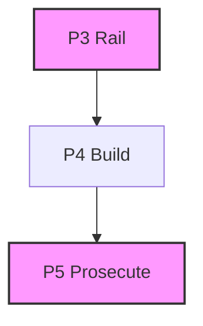

# hollow-test

**ADLC phase: P3/P5 Rail/Prosecute**

### ADLC Lifecycle Context




Diff-scoped mutation gate — the honest coverage check. Mutates only the lines
changed in your diff, runs your test suite against each mutant, and fails if
any mutation survives. A surviving mutant proves hollow coverage: lines are
executed but their behavior is unconstrained by any assertion.

Diff-scoping keeps the run at seconds-to-minutes rather than the hours that
kill whole-codebase mutation testing.

## Usage

```
hollow-test --test-cmd "node --test test/" [options]
```

### Flags

| Flag | Default | Description |
|------|---------|-------------|
| `--test-cmd <cmd>` | *(required)* | Shell command to run the test suite. Must exit non-zero on failure. |
| `--base <ref>` | `HEAD` | Git base ref for the diff (e.g. `HEAD~1`, `main`, a SHA). |
| `--max <n>` | `20` | Maximum total mutants across all files. Budget is spread round-robin. |
| `--timeout-ms <n>` | `120000` | Per-mutant test-command timeout in milliseconds. |
| `--json` | *(off)* | Machine-readable JSON output (for orchestrators). |
| `--help` | *(off)* | Show usage and exit 0. |

### Exit codes

| Code | Meaning |
|------|---------|
| `0` | Gate passes — all mutants were killed (or no mutable lines in diff). |
| `1` | Operational error — dirty working tree, not a git repo, bad arguments. |
| `2` | Gate fails — one or more mutants survived (hollow coverage). |

## Examples

```bash
# Check the last commit
hollow-test --test-cmd "node --test test/" --base HEAD~1

# Check staged changes vs main
hollow-test --test-cmd "npm test" --base main --max 30

# Machine-readable output for CI
hollow-test --test-cmd "node --test test/*.test.mjs" --json
```

## Safety guarantees

1. **Dirty-tree check**: refuses to run if `git status --porcelain` is non-empty.
   This prevents accidentally leaving a corrupted file if the process is
   interrupted. Commit or stash your changes first.

2. **File restoration**: every mutated file is restored via a `try/finally`
   block — even if the test command crashes or the process is interrupted via
   SIGINT. The SIGINT handler performs an emergency restore before exiting.

3. **Sequential execution**: mutants are applied and tested one at a time
   (never in parallel) to avoid concurrent writes to the same file.

## What is mutated (and what is skipped)

Mutation applies to plain JavaScript only: `.mjs`, `.cjs`, `.js`. This is an
**allow-list**. TypeScript and JSX (`.ts`, `.mts`, `.cts`, `.tsx`, `.jsx`),
Python, CSS and everything else are excluded, because the operators are
text-based and cannot tell a comparison from a type argument or a JSX
delimiter — `Promise<unknown>` becomes the invalid `Promise>=unknown>`, and a
parse failure is currently scored as a *killed* mutant. See issue #293.

A file is also skipped when a path **segment** is `test`, `tests`, `spec`,
`specs`, or `__tests__`, or when its **basename** matches a `node --test`
discovery convention: `test.js`, `test-*`, `test_*`, `*-test.*`, `*_test.*`,
`*.test.*` (and the `spec` equivalents).

Matching is segment- and basename-anchored on purpose: a substring test would
exclude production paths such as `packages/hollow-test/lib/targets.mjs` or
`lib/attest.mjs`.

Two escape hatches, because no convention resolves every case:

- `--test-glob <glob>` — treat additional paths as tests.
- `--source-glob <glob>` — treat paths as production source even when their name
  matches a test convention. Needed for product names like `hollow-test.mjs` and
  `spec-lint.mjs`, which are indistinguishable from tests by naming alone. For the same reason, **hyphenated** forms (`foo-test.js`,
`spec-foo.js`) are *not* treated as tests — a hyphen is ambiguous between a test
convention and a product name, and `hollow-test.mjs` and `spec-lint.mjs` are
production files. If you use that convention, keep tests in a `test/` directory
or name them `*.test.*`.

Within eligible files, only lines changed in the diff are targeted. Lines that
are blank, comments, imports, `export {`, or `console.*` calls are skipped.

### Invalid mutants

A mutation that produces code Node cannot parse is **discarded**, not scored.
Line-based operators produce these routinely — `null-return` rewrites a
multiline `return {` to `return null;` and strands the object literal's
remaining lines.

This matters because a kill is inferred from a non-zero exit, and a file that
does not parse also exits non-zero. Counting such a mutant as *killed* fakes
coverage; counting it as *survived* blames the tests for code that was never
valid. It is reported in its own `invalid` bucket in both the table and JSON.

If **every** mutant in a run is invalid, hollow-test exits **1** (operational
failure) rather than passing: no assertion was exercised, so the run proves
nothing.

Validation uses `node --check`, so no parser dependency is added and the real
file extension and package type are honoured. Both the syntax check and the test run are **tri-state** — `valid`, `invalid`, or `unknown`. "Could not
determine" never collapses into "valid": if the checker is killed, times out, or
cannot spawn, the run fails operationally rather than guessing. The same applies to the test command itself: a spawn failure (EAGAIN, ENOMEM) is not a timeout, and a timeout is the only non-completion that counts as a kill. A kill must mean the tests ran and failed.

The all-invalid guard is applied **per file**, not just globally, so an
explicitly named `--target` cannot go untested while some other file's kill
carries the run.

### Mutation operators (from `@adlc/core`)

| Operator | Example |
|----------|---------|
| `invert-comparison` | `===` → `!==`, `<=` → `>` |
| `bool-flip` | `true` → `false` |
| `null-return` | `return expr` → `return null` |
| `off-by-one` | literal `n` → `n+1` |
| `logic-swap` | `&&` → `\|\|` |

## JSON output schema

```json
{
  "tool": "hollow-test",
  "summary": {
    "total": 5,
    "killed": 4,
    "survived": 1
  },
  "mutants": [
    {
      "file": "src/calc.mjs",
      "line": 7,
      "operator": "null-return",
      "status": "survived",
      "timedOut": false,
      "original": "  return a + b;",
      "mutated": "  return null;"
    }
  ]
}
```

## Relationship to sibling tools

- **rails-guard (C5)**: enforces that test files are not modified during build
  (they are the measuring instrument). hollow-test verifies that those tests
  actually constrain behavior.
- **review-calibration (C8)**: uses the same `mutate` operators to plant bugs
  and measure reviewer recall. hollow-test and review-calibration share core
  mutation machinery.
- **flail-detector (C6)**: hollow-test is a P3 gate; flail-detector watches
  the P4 build session. They serve complementary phases.

## Core gaps

None. All required functionality (`gitDiff`, `isDirty`, `isGitRepo`,
`mutate.generateMutants`, `mutate.applyMutant`, `mutate.changedLinesFromDiff`,
`parseArgs`, `pass`, `gateFail`, `opError`, `printJson`) is available in
`@adlc/core`.

## Implementation notes

### NODE_TEST_CONTEXT stripping

Node.js v22 sets `NODE_TEST_CONTEXT` in child process environments when
running under `node --test`. If a child process inherits this variable and
itself calls `node --test`, it silently skips all test files (exits 0).
hollow-test strips `NODE_TEST_CONTEXT` from the child environment before
running each mutant's test command. This ensures mutation trials work
correctly even when hollow-test is itself running inside a test harness.
