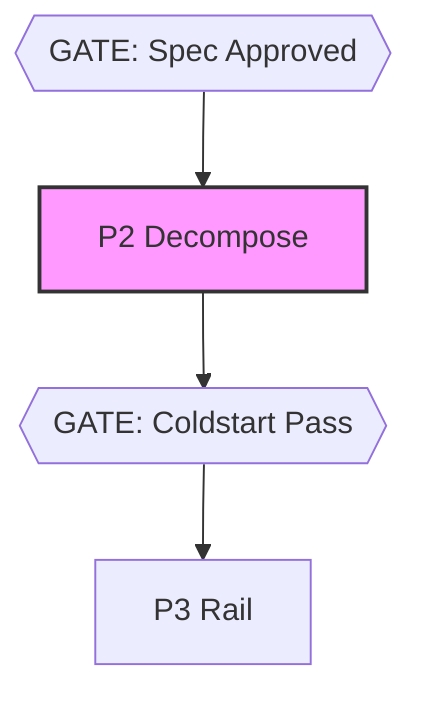

# @adlc/merge-forecast

**ADLC phase: P2 Decompose**

### ADLC Lifecycle Context




Conflict forecast + dispatch schedule for parallel ticket execution. Predicts merge conflicts before any agent runs, certifies the safe fan-out width, and emits a foundation-first merge schedule.

## Usage

```
merge-forecast [options]

Options:
  --tickets <path>           Path to tickets JSON (default: .adlc/tickets.json)
  --width <N>                Desired fan-out width; gate fails (exit 2) if > certifiedWidth
  --build-min <X>            Mean ticket build time in minutes (for backpressure width)
  --merge-min <Y>            Mean merge-rebase-regreen time in minutes
  --co-change-limit <N>      Git log depth for co-change mining (default: 500)
  --conflict-threshold <F>   Score >= this triggers SEQUENCE verdict (default: 0.5)
  --json                     Machine-readable JSON output
  --help                     Show this help
```

## Exit Codes

| Code | Meaning |
|------|---------|
| 0    | Gate passes — schedule is safe at the recommended width |
| 1    | Operational error — bad tickets file, unresolvable input |
| 2    | Gate fails — `--width` exceeds certifiedWidth, or vetoed/high-risk pair scheduled concurrently |

## Signals

Each parallel-eligible ticket pair (neither is an ancestor of the other in the DAG) is scored by four signals. **Combined score = max of individual signals.**

| Score | Signal | Description |
|-------|--------|-------------|
| 1.0   | `scope-overlap` | **HARD VETO** — tickets' declared scope globs overlap. These must serialize. |
| 0.8   | `namespace-collision` | Dynamic route segments conflict (`[pk]` vs `[voteKey]` at same path depth) or migration prefix collision (`drizzle/0005_*` vs `migrations/0005_*`). |
| 0.6   | `import-radius` | Files matching ticket A's scope import from ticket B's scope or vice versa. |
| 0–0.5 | `co-change` | Historical co-commit coupling: `pairCount / min(fileCountA, fileCountB) × 0.5`. |

Pairs at or above `--conflict-threshold` get a `SEQUENCE` verdict. Below threshold: `PARALLEL`.

## Width Analysis

- **certifiedWidth** — greedy largest independent set among wave-1 tickets (tickets where all pairs are below threshold).
- **backpressureWidth** — `round(buildMin / mergeMin)` when both flags are given. Derived from integrator-lane throughput: if builds complete faster than merges absorb them, queue depth compounds.
- **recommendedWidth** — `min(certifiedWidth, backpressureWidth?, --width?)`.

## Schedule

The schedule is derived from the ticket DAG via Kahn topological waves. All tickets in the same wave are ready to build concurrently (their dependencies completed in earlier waves). The merge order is **foundation-first** (ticket dependencies merge before their dependants; within a tier, first-done-first-merged).

## Examples

```sh
# Basic forecast (auto-detect .adlc/tickets.json)
merge-forecast

# Gate against fan-out width
merge-forecast --width 4

# With backpressure — 20-min builds, 4-min merges
merge-forecast --width 5 --build-min 20 --merge-min 4

# JSON output for orchestrators
merge-forecast --json

# Custom tickets path + looser threshold
merge-forecast --tickets plan/tickets.json --conflict-threshold 0.7

# Deep co-change history
merge-forecast --co-change-limit 1000
```

## Relation to Sibling Tools

- **Upstream**: Tickets are produced by `model-router` (P2 phase). This tool validates the partition quality before agents run.
- **Downstream**: `rails-guard` enforces the contract rails that `merge-forecast` identifies as conflict surfaces.
- **Complement**: After completing parallel branches, `merge-forecast` can be re-run against the updated main to confirm rebase safety.

## Core Gaps

None. All required functionality is available in `@adlc/core` (`coChange`, `pairKey`, `isGitRepo`, `topoSort`, `globMatch`, `scopesOverlap`, `loadTickets`).
