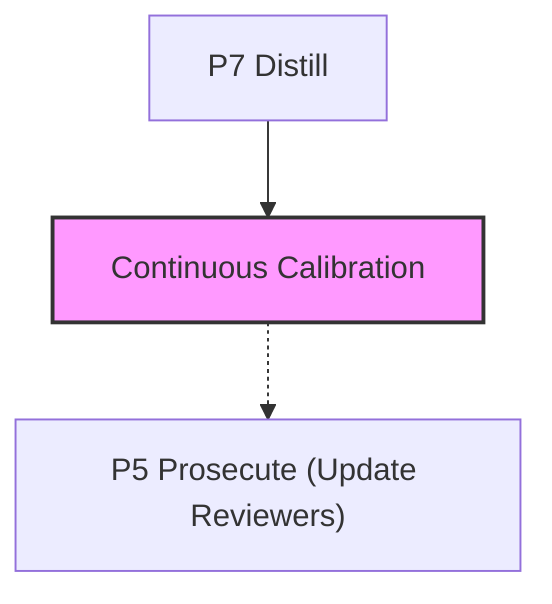

# @adlc/model-ratchet

**ADLC Phase:** Continuous calibration

### ADLC Lifecycle Context




Scheduled re-prosecution of hot paths — **ADLC C12**.

Every frontier model release is a free re-audit of the existing codebase: new
models find what old ones missed. `model-ratchet` identifies the most valuable
files to re-prosecute (high churn × high criticality), then either prints a
prosecution plan or drives your review command over them, appending verified
findings to the shared `.adlc/findings` ledger.

Run on every model release (or monthly) to ratchet codebase quality
monotonically upward for the cost of a scheduled job.

## ADLC Phase

**C12 / D1–D3 maintenance ratchet.** Pairs with:
- **C8 review-calibration** — calibrate the new model's recall first, then aim it at hot paths.
- **C9 lesson-foundry** — verified findings become lessons that compound into skills.

## Installation

```bash
npm install -g @adlc/model-ratchet   # or use npx
```

## Usage

```
model-ratchet [--top <n>] [--review-cmd <cmd>] [--churn-limit <n>] [--dry-run] [--json]
```

### Flags

| Flag | Default | Description |
|------|---------|-------------|
| `--top <n>` | `10` | Number of hotspot files to select |
| `--review-cmd <cmd>` | — | Shell command to run per file. Use `{file}` as placeholder. |
| `--churn-limit <n>` | `1000` | Commit history depth for churn computation |
| `--dry-run` | `false` | Print prosecution plan only; do not run review-cmd |
| `--json` | `false` | Machine-readable JSON output |
| `--help` | — | Show help |

## Hot Score Formula

```
SCORE = churn(limit)[file] × (1 + inDegree)
```

- **churn(limit)[file]** — number of distinct commits touching the file in the
  last `--churn-limit` commits (via `git log`).
- **inDegree** — number of repo source files (`.mjs/.js/.ts/.tsx/.py`, walk
  skips `node_modules/`, `.git/`, `dist/`) whose `import`/`require`/`from`
  specifiers resolve (relative resolution, try extensions) to this file.

Test/spec files (`.test.*`, `.spec.*`, `test/`, `__tests__/`) and non-source
files (`.md`, `.json`, lock files) are excluded from both the candidate set
and the import graph.

## Default Mode (no `--review-cmd`, or with `--dry-run`)

Prints the prosecution plan table and suggested charter lines per file:

```
model-ratchet — Prosecution Plan
====================================================================
FILE                        CHURN  IN-DEGREE  SCORE
--------------------------  -----  ---------  -----
src/auth.mjs                   42          3    168
src/db/query.mjs               31          5    186
src/utils.mjs                  25          1     50

Suggested charter lines:
  Refute correctness of src/auth.mjs — hotspot: changed 42 times, imported by 3 files
  ...
```

## Review Mode (`--review-cmd`)

Runs the command for each selected file with `{file}` substituted. Captures
stdout and parses findings:

- Lines matching `/\S+:\d+/` (e.g. `src/foo.js:42: missing null check`)
- Lines starting with `- ` (bullet items)

Each finding is appended to `.adlc/findings.jsonl`:

```json
{
  "ts": "2026-01-01T00:00:00.000Z",
  "tool": "model-ratchet",
  "file": "src/auth.mjs",
  "line": 42,
  "category": "ratchet",
  "severity": "unknown",
  "desc": "src/auth.mjs:42: missing null check"
}
```

Exit code 2 from `review-cmd` is treated as "findings present" (not an error).
Exit codes other than 0 or 2 cause an operational error (tool exits 1).

## Exit Codes

| Code | Meaning |
|------|---------|
| `0` | Success — plan printed or review run complete |
| `1` | Operational error — not a git repo, bad `--review-cmd` exit code, bad args |
| `2` | Not used by `model-ratchet` itself (reserved for gate-fail; review-cmd findings go to ledger) |

## Examples

```bash
# Print prosecution plan for top 10 hot files
model-ratchet

# Top 5 files, last 500 commits
model-ratchet --top 5 --churn-limit 500

# Dry-run plan even if review-cmd is provided
model-ratchet --top 10 --review-cmd "adversarial-review {file}" --dry-run

# Run adversarial review and append findings
model-ratchet --review-cmd "adversarial-review --file {file}"

# Machine-readable output for orchestrators
model-ratchet --top 5 --json

# Run a custom linter as the reviewer
model-ratchet --review-cmd "eslint {file} --format compact"
```

## Cron and CI Examples

### GitHub Actions — on every model release

```yaml
# .github/workflows/model-ratchet.yml
name: model-ratchet

on:
  # Manually trigger when a new model is released
  workflow_dispatch:
  # Or run monthly
  schedule:
    - cron: '0 9 1 * *'

jobs:
  ratchet:
    runs-on: ubuntu-latest
    steps:
      - uses: actions/checkout@v4
        with:
          fetch-depth: 0  # needed for full churn history
      - uses: actions/setup-node@v4
        with:
          node-version: '20'
      - name: Run model-ratchet
        run: |
          npx @adlc/model-ratchet \
            --top 10 \
            --review-cmd "npx @adlc/adversarial-review --file {file}" \
            --json > ratchet-results.json
      - uses: actions/upload-artifact@v4
        with:
          name: ratchet-findings
          path: .adlc/findings.jsonl
```

### Cron (shell)

```bash
# Run on every model release — add to crontab or a release script
# crontab entry: run on the 1st of every month at 09:00
# 0 9 1 * * cd /path/to/repo && model-ratchet --top 10 --review-cmd "adversarial-review {file}" --json >> .adlc/ratchet-runs.log 2>&1

# Or run manually after a model upgrade:
model-ratchet --top 20 --review-cmd "adversarial-review --file {file}" --json
```

### CI gate (plan-only, no API key required)

```yaml
- name: Print hot paths prosecution plan
  run: npx @adlc/model-ratchet --top 10 --json
```

## Core Gaps

None. Uses `churn()`, `isGitRepo()`, `appendEntry()`, `parseArgs()`, `opError()`,
`pass()`, `printJson()` from `@adlc/core`. All hot-score logic, import-graph
walking, and finding parsing live in `lib/`.

## Relationship to Sibling Tools

- **adversarial-review** — natural choice for `--review-cmd`; `model-ratchet`
  aims it at the highest-value files.
- **review-calibration (C8)** — calibrate first, then ratchet.
- **lesson-foundry (C9)** — consume the `.adlc/findings` ledger entries that
  `model-ratchet` appends.
- **gate-manifest (C11)** — findings from ratchet runs appear in the shared
  findings ledger that manifests track.
