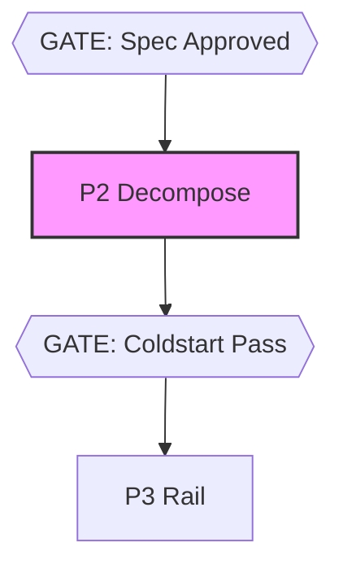

# @adlc/model-router

**ADLC Phase:** P2 Decompose

### ADLC Lifecycle Context




Deterministic per-ticket model assignment (ADLC phase D1). No LLM calls.
Reads the ticket DAG and manifest ledger history, then emits tier + mode
for every ticket so the dispatcher knows which model to invoke and whether
to ladder.

## Usage

```
model-router [--tickets <path>] [--floor <number>] [--json]
```

### Flags

| Flag | Default | Description |
|------|---------|-------------|
| `--tickets <path>` | `.adlc/tickets.json` | Path to the tickets file |
| `--floor <0-1>` | `0.2` | Minimum rail density for cheap-tier assignment |
| `--json` | off | Machine-readable JSON output (for orchestrators) |

## Output

### Human table (default)

Columns: `id`, `tier`, `mode`, `railDensity`, `float`, `reason`

```
id            tier        mode      railDensity  float   reason
---------------------------------------------------------------
AUTH-1        cheap       ladder    1.000        3       float=3 → ladder starting at 'cheap' (railDensity=1.000)
AUTH-2        frontier    direct    0.000        0       category 'spec' requires frontier model
```

### JSON (--json)

```json
{
  "assignments": [
    {
      "id": "AUTH-1",
      "tier": "cheap",
      "mode": "ladder",
      "railDensity": 1.0,
      "float": 3,
      "reason": "..."
    }
  ],
  "p3Findings": []
}
```

## Exit codes

| Code | Meaning |
|------|---------|
| `0` | All tickets assigned; gate passes |
| `1` | Operational error (bad tickets file, JSON parse error, cycle in DAG) |
| `2` | Gate fails: one or more non-frontier-category tickets have `railDensity < floor` |

## Assignment rules (ADLC D1)

### Rule 1: Frontier / Direct

Applies when:
- `ticket.category` is one of `contract`, `spec`, `architecture`
- OR `railDensity < floor` (regardless of category — this also triggers exit 2)

Result: `tier=frontier`, `mode=direct`

Rationale: These tickets produce outputs that are hard to verify deterministically (contracts, specs) or where an escaped error is expensive to find. Only the frontier model is appropriate. Tickets below the rail-density floor are also sent here because the gates are insufficient to catch regeneration failures cheaply — this is surfaced as a P3 finding (the ticket is not railed enough to build cheaply).

### Rule 2: Direct (critical path)

Applies when: `float === 0` (ticket is on the critical path)

Result: `mode=direct`, `tier` = best-performing tier from prior data with >= 3 samples, else `mid`

Rationale: A failed attempt on a critical-path ticket delays the entire delivery. Skip the escalation ladder; go straight to the highest first-pass-rate tier.

### Rule 3: Ladder (has slack)

Applies when: `float > 0`

Result: `mode=ladder`, `tier` = `cheap` if `railDensity >= 0.5` else `mid`

Rationale: Retries on tickets with DAG float are absorbed by schedule slack with no wall-clock penalty. Start cheap; the escalation harness regenerates one tier up on gate failure, appending the known-dead-ends to the ticket context.

## Concepts

### Rail density

```
railDensity = min(1, rails.length / max(1, scope.length))
```

`rails` is the list of frozen paths that provide deterministic checks (test files, contract files). `scope` is the set of paths the ticket may touch. High density means most outputs are covered by fast, deterministic gates; errors are caught cheaply and regeneration is inexpensive.

Density of `0` (no rails) means there are no automated gates — any error escapes to humans. Such tickets are routed to `frontier` regardless of category and trigger a P3 gate-fail finding.

### DAG float (CPM)

Classic critical-path-method float from `computeFloat()` in `@adlc/core`. Float is the amount of time a ticket can slip without delaying the overall delivery (`makespan`). Tickets on the critical path have `float === 0`.

### Priors from the manifest ledger

Every `build`-type entry in `.adlc/manifest.jsonl` with shape `{ model, category, firstPass: boolean }` is counted. Success rate per model (and per model + category when >= 3 samples exist) is computed with Laplace smoothing:

```
rate = (passes + 1) / (n + 2)
```

For critical-path tickets (Rule 2), the model name in the ledger is matched against the tier names `cheap`, `mid`, `frontier` to produce a tier recommendation. If no tier-named model has enough data, defaults to `mid`.

## ADLC phase

D1 — The cost dial: model routing.

model-router is the first decision in the D-series (Dispatch). It runs before fan-out (D2) and merge-forecast. Its output drives the dispatcher's `--tier` and `--mode` arguments.

Sibling tools:
- `fan-out` (D2) — uses the tier assignments to set parallelism budgets
- `flail-detector` — triggers escalation when a running job exceeds the failure threshold, consuming the `mode=ladder` assignments
- `rails-guard` — enforces that `rails` paths exist before allowing the build to start

## Core gaps

None. All required APIs (`loadTickets`, `computeFloat`, `readEntries`, `parseArgs`, `pass`, `gateFail`, `opError`, `printJson`) are available in `@adlc/core`.
