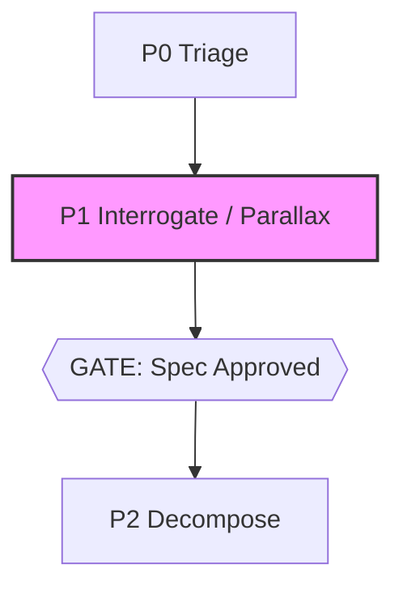

# @adlc/parallax

Measured-ambiguity interrogation for feature requests, ticket edge contracts, and mid-build routing questions. Replaces single-model introspection with **sampling diversity as an instrument**: fan N independent cheap-tier completions, diff the readings, surface only the divergences as multiple-choice questions.

**ADLC phase:** P1/D3 Spec shaping

### ADLC Lifecycle Context



 D3 — Measured Ambiguity

---

## Modes

### SPEC MODE (default)

Fan N independent readers over a raw feature request. Each commits to one reading and outputs a structured spec. A mid-tier completion diffs the readings into an **agreement set** (draft spec) and **divergences** (questions only humans can answer). An ambiguity score gates the output.

```
parallax --request "text"
parallax --file req.md
echo "feature request" | parallax
```

### EDGE MODE

Fan N agents over two adjacent tickets in the development DAG. Each independently authors the interface/contract implied between them. Same divergence analysis gates whether the edge contract is safe to speculate on.

```
parallax --edge T1 T2
parallax --edge T1 T2 --tickets path/to/tickets.json
```

### ROUTE MODE (ambiguity router)

Fan N agents to answer a question given optional context files. A judge completion decides whether the answers are semantically equivalent. If yes, print the answer and exit 0. If no, print multiple-choice divergences and exit 2.

```
parallax --route "question"
parallax --route "question" --context spec.md --context arch.md
```

---

## Flags

| Flag | Default | Description |
|------|---------|-------------|
| `--request <text>` | — | Spec mode: feature request inline |
| `--file <path>` | — | Spec mode: feature request from file |
| `--edge` | false | Edge mode: follow with two ticket IDs as positionals |
| `--route <text>` | — | Route mode: question to route |
| `--context <file>` | — | Route mode: context file (repeatable) |
| `--tickets <path>` | `.adlc/tickets.json` | Tickets file for edge mode |
| `--n <int>` | 3 | Fan width (number of independent readings) |
| `--threshold <0-1>` | 0.25 | Ambiguity score gate threshold |
| `--tier cheap\|mid\|frontier` | cheap for fan, mid for divergence | Override LLM tier |
| `--json` | false | Machine-readable output (score + divergences) |
| `--prompt-only` | false | Print exact prompts, exit 0 — no API key needed |

---

## Exit codes

| Code | Meaning |
|------|---------|
| 0 | Gate passes — ambiguity score ≤ threshold (spec/edge), or answers equivalent (route) |
| 1 | Operational error — bad input, missing file, network failure, insufficient readings |
| 2 | Gate fails — ambiguity score > threshold (spec/edge), or answers diverge (route) |

---

## Report format

**SPEC / EDGE mode output:**
```markdown
## Agreement set (draft spec)
- <thing all readings agreed on>
- ...

## Divergences — answer these
**Q1: <ambiguous point>**
  A) <reading 1's choice>
  B) <reading 2's choice>

---
**Ambiguity score:** 0.33 (threshold 0.25) — gate FAILS ✗
```

**ROUTE mode output (equivalent):**
```
<The single consensus answer, printed directly>
```

**ROUTE mode output (divergent):**
```markdown
## Route conflict — answer required

**Question:** <question>

**Interpretations:**
  A) <variant 1>
  B) <variant 2>
```

---

## JSON output (`--json`)

Spec/edge:
```json
{
  "mode": "spec",
  "agreements": ["..."],
  "divergences": [{"point": "...", "options": [{"label": "A", "reading": "..."}]}],
  "score": 0.33,
  "threshold": 0.25,
  "gate": false,
  "warnings": []
}
```

Route:
```json
{
  "mode": "route",
  "question": "...",
  "equivalent": false,
  "answer": "",
  "variants": ["option A", "option B"],
  "warnings": []
}
```

---

## Ambiguity score

`score = divergences / (divergences + agreements)`, rounded to 2 decimal places.

- 0.00 = perfect convergence (nothing to ask)
- 1.00 = total divergence (no agreement at all)
- Default gate threshold: 0.25

The score is the key output: a spec that converged at N=5 with score 0.00 is a measurably safer artifact than any single-model pronouncement of completeness.

---

## Relationship to sibling tools

- **grill-me** — predecessor; interrogation by introspection (single context, sequential). `parallax` replaces it with measurement.
- **spec-lint (C1)** — can gate on the ambiguity score that `parallax` emits.
- **model-router (D2)** — uses edge contracts that `parallax --edge` validates before speculative execution.
- **flail-detector** — triggers `parallax --route` mid-build to route builder questions through the machine before escalating to humans.

---

## Core gaps

None. All required functions (`fan`, `complete`, `extractJson`, `loadTickets`, `promptOnly`, `parseArgs`, `pass`, `gateFail`, `opError`, `printJson`, `readStdin`) are present in `@adlc/core`.
