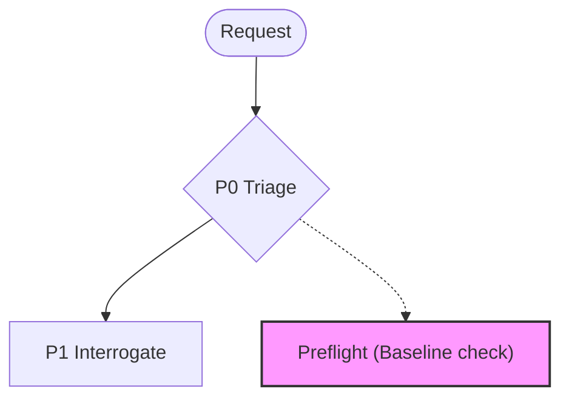

# @adlc/preflight

**ADLC Phase:** P0 Triage / Preflight

### ADLC Lifecycle Context




Permissions and environment preflight check before fan-out (ADLC D2 Phase 0).

Runs isolated checks to verify that every operation class the agent fleet needs
actually works in the current environment — so permission prompts and
configuration failures front-load into one batch instead of stalling mid-flight.

From the ADLC D2 field notes:

> A permission prompt mid-flight is a hidden serialization point: one blocked
> agent × N teammates = N stalls, racing siblings, and half-started state.
> Environment determinism is a precondition of parallel wall-clock math.

## Usage

```
preflight [--test-cmd "..."] [--gh] [--llm] [--worktrees] [--json]
```

### No flags — required checks only

```
preflight
```

Runs the four required checks (bash, git, write, branch) and prints a table plus
a verdict line. Exit 0 if all pass; exit 2 if any fail.

### With optional checks

```
preflight --test-cmd "npm test" --gh --llm --worktrees
```

## Flags

| Flag | Type | Description |
|------|------|-------------|
| `--test-cmd "CMD"` | string | Run CMD via `sh -c`, expect exit 0. Tail of output shown on failure. |
| `--gh` | boolean | Run `gh auth status`; expect exit 0. |
| `--llm` | boolean | Call `detectProvider()` and assert it is non-null. No API call made. Reports which provider was found. |
| `--worktrees` | boolean | `git worktree add --detach .worktrees/preflight-test HEAD` then remove. |
| `--json` | boolean | Machine-readable output: `{ checks, verdict, failedNames }`. |

## Checks

### Required (always run)

| Name | What it tests |
|------|---------------|
| `bash` | `echo preflight-ok` succeeds |
| `git` | `git status` in cwd succeeds (cwd must be a git repo) |
| `write` | Write + delete `.adlc/tmp/preflight-test` (mkdir -p as needed) |
| `branch` | Create and delete `preflight-test-branch`; always cleans up in finally |

### Optional (run only when flag given)

| Name | Flag | What it tests |
|------|------|---------------|
| `worktrees` | `--worktrees` | `git worktree add/remove` cycle; always cleans up in finally |
| `test-cmd` | `--test-cmd "CMD"` | Runs CMD via sh, expects exit 0 |
| `gh` | `--gh` | `gh auth status` exits 0 |
| `llm` | `--llm` | `detectProvider()` returns non-null (no API call) |

## Exit codes

| Code | Meaning |
|------|---------|
| 0 | Gate passes — all checks (required + explicitly requested optional) passed |
| 1 | Operational / internal error |
| 2 | Gate fails — one or more required or explicitly requested checks failed |

Note: optional checks that are NOT requested are not run and cannot fail.
When a flag like `--gh` is passed, that check becomes required for this run.

## Output

### Human-readable (default)

```
──────────────────────
check      status  detail
──────────────────────
bash       ✓ PASS    echo preflight-ok succeeded
git        ✓ PASS    git status succeeded
write      ✓ PASS    .adlc/tmp/preflight-test written and removed
branch     ✓ PASS    branch 'preflight-test-branch' created and removed
worktrees  ✓ PASS    worktree add/remove succeeded
test-cmd   ✓ PASS    exited 0
──────────────────────

verdict: ALL CHECKS PASSED — environment is ready.
```

### JSON (`--json`)

```json
{
  "checks": [
    { "name": "bash",   "status": "pass", "detail": "echo preflight-ok succeeded", "required": true },
    { "name": "git",    "status": "pass", "detail": "git status succeeded",          "required": true },
    { "name": "write",  "status": "pass", "detail": ".adlc/tmp/preflight-test written and removed", "required": true },
    { "name": "branch", "status": "pass", "detail": "branch 'preflight-test-branch' created and removed", "required": true }
  ],
  "verdict": "pass",
  "failedNames": []
}
```

## ADLC phase served

**D2 Phase 0** (pre-fan-out environment gate). Run once before spawning the
parallel agent fleet to ensure every operation class succeeds. Integrates with
`team-develop` as Phase 0 of the parallel build pipeline.

## Cleanup guarantees

Every check that creates a side effect (branch, worktree, tmp file) performs
cleanup in a `finally` block — residue is removed whether the check passes or
fails.

## Relationship to sibling tools

- `merge-forecast` — uses after preflight confirms the environment is ready; validates the ticket DAG and forecasts conflict probability before the fan-out.
- `gate-manifest` — records gate passage events into the ADLC manifest ledger; preflight should record its passage there in orchestrated flows.

## Core gaps

None. All required core APIs (`detectProvider`, `git`, `parseArgs`, `printJson`)
are available in `@adlc/core`.
