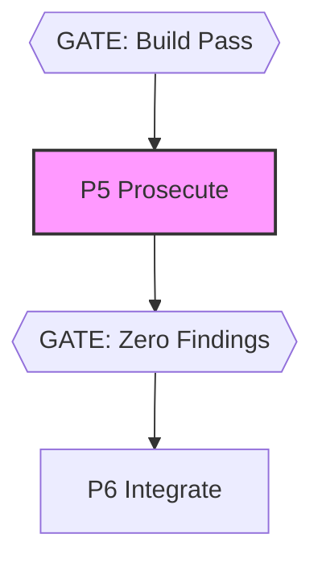

# @adlc/prosecute

**ADLC Phase:** P5 Prosecute

### ADLC Lifecycle Context




P5 review-evidence recorder. It does not run a model review by itself. It consumes
normalized reviewer-produced pass evidence, records ticket- and revision-scoped P5
evidence to `.adlc/manifest.jsonl`, and passes only after two consecutive dry passes
with at least three distinct dry lenses.

## Usage

```sh
adlc-prosecute --input p5-passes.json --ticket T1 --dir .adlc --json
```

## Input shape

```json
{
  "target": "feature branch",
  "provenance": {
      "reviewer": "local-reviewer",
      "session": "codex-session-123",
      "command": "npx adversarial-review --scope working-tree --include-files",
      "transcript": ".omo/evidence/p5-review.txt"
  },
  "review_packet": {
      "prompt": ".omo/evidence/p5-prompt.txt",
      "prompt_hash": "sha256-of-prompt-file",
      "inputs": ".omo/evidence/p5-inputs.txt",
      "inputs_hash": "sha256-of-reviewed-input-packet",
      "clean_worktree": "git-worktree:..."
  },
  "passes": [
    {
      "lens": "security",
      "findings": [
        {
          "id": "F1",
          "severity": "high",
          "category": "security",
          "file": "src/auth.js",
          "line_start": 10,
          "line_end": 12,
          "evidence": "quoted changed code",
          "claim": "token bypass",
          "recommendation": "validate issuer",
          "confidence": 0.8,
          "verified_status": "verified"
        }
      ]
    },
    {
      "lens": "security",
      "findings": [],
      "dry_evidence": "review transcript reports no verified security findings"
    },
    {
      "lens": "correctness",
      "findings": [],
      "dry_evidence": "review transcript reports no verified correctness findings"
    }
  ]
}
```

`verified_status` must be `verified`, `killed`, or `needs-human`. Killed findings must
include `verification.reason`, `verification.method`, and `verification.evidence`.
Inputs must use the built-in lens names: `security`, `correctness`, `tests`, `behavior`,
`integration`, or `docs`. Clean reviews with zero finding candidates are accepted when the
dry passes include evidence. If no finding is marked `verified`, the input must include
`no_findings_attestation` with
`reason`, `method`, and `evidence`. Only passes with zero findings count as dry; killed
findings are recorded but do not advance dry-pass convergence.

The transcript is not treated as a generic attachment. It must be readable, at least 64
bytes, and it must reference both the `--ticket` value and the resolved reviewed revision
string (`git-worktree:<hash>` unless `--revision` is supplied). This binds the recorded
P5 evidence to the ticket and revision that P6 later checks, but it still does not prove
that an external reviewer ran. Use the named `provenance.command` and transcript from the
actual skeptical review run, not a hand-written placeholder.

The review packet binds the reviewer prompt and reviewed input packet to P5 evidence.
`prompt` and `inputs` are file paths, their hashes must match the supplied SHA-256 values,
and `clean_worktree` must equal the exact reviewed revision.

## Exit codes

- `0`: two consecutive dry passes were recorded
- `1`: operational error
- `2`: verified/needs-human findings remain or the convergence budget ended before two dry passes

## ADLC phase

P5 Prosecute. This tool makes the review-evidence and dry-pass record executable, but
the reviewer command named in `provenance.command` remains the source of the review.
