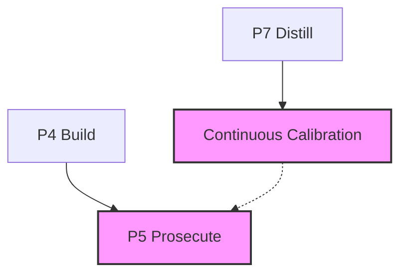

# @adlc/review-calibration

**ADLC phase: P5 Prosecute / Continuous calibration**

### ADLC Lifecycle Context




Measures reviewer recall via planted bugs. Turns "we do adversarial review"
from a vibe into a number, exposes category-level blind spots, and re-runs on
every model change — catching the silent regressions everyone currently absorbs
unknowingly.

This is mutation testing aimed at the *reviewer* instead of the code (ADLC C8).

## How it works

1. **Target files**: Files changed in `--commit` (`git diff-tree`) filtered to
   non-test, non-config source code. Falls back to `--files` if the commit
   touches no eligible files.
2. **Plant selection**: `mutate.generateMutants` runs over each target file's
   full content. Up to `--plants` mutants are selected by round-robining across
   operators for coverage. Each plant carries a real bug **category** (off-by-one,
   logic-inversion, null-handling, …) and a **defect** description. `--plants-file`
   plants may also carry a **witness**.
3. **Equivalent-mutant filter**: a plant with a witness must DISCRIMINATE
   (pass on the original, fail on the mutant). Plants whose witness does not
   discriminate are equivalent mutants — there is no bug to find, so they are
   excluded from the denominator rather than scored as missed.
4. **Control self-test**: before scoring, two reference reviewers run — an
   *echoer* (must score ~0) and an *oracle* (must score 1.0). If either is wrong
   the scorer itself is broken and the tool exits 1. This bound is what makes the
   recall number trustworthy.
5. **Apply all plants**, **run `--review-cmd`** (`{base}` → commit ref), **restore**
   (always, via `finally` + SIGINT handler).
6. **Parse findings**: the reviewer's output is parsed as structured findings
   (adversarial-review `--json` shape, or a weak prose fallback).
7. **Score**: a plant is CAUGHT only when a finding LOCATES it (file + line ±3)
   **AND** identifies the defect — verified behaviorally (a reviewer-supplied
   `repro` that discriminates) or judged semantically by a cheap model. There is
   **no string-match shortcut**: a reviewer that echoes changed lines scores ~0.
   Recall = caught / valid plants. Precision = true / (true + spurious findings).
8. **Gate**: Exit 2 if recall < `--min-recall` (or precision < `--min-precision`
   when set); exit 0 otherwise. Exit 1 on operational error or a failed control.

### Scorer modes (`--scorer`)

- **`judge`** (default) — cheap-model semantic match. Requires an LLM provider
  (`ANTHROPIC_API_KEY` / `OPENAI_API_KEY` / `GEMINI_API_KEY`). With no provider
  the tool **fails closed** (exit 1) rather than emit an untrustworthy number.
  A reviewer-supplied `repro` is verified behaviorally and bypasses the judge.
- **`string`** — LEGACY location-only matching. Gameable by a reviewer that
  echoes changed lines; prints a warning and is not a trustworthy recall number.
  Provided only as an offline escape hatch.

See `REDESIGN.md` for the full design and the rationale for each decision.

## Safety

- **Refuses to run on a dirty working tree** (opError, exit 1). Commit or stash first.
- Files are **always restored** — `finally` block in the runner + SIGINT handler
  in the CLI.
- Exit codes from the review command: 0 and 2 are valid (pass / gate-fail).
  Any other exit code is treated as a crash (opError, exit 1).

## Usage

```
review-calibration --review-cmd "cmd with {base} placeholder" [options]
```

### Options

| Flag | Default | Description |
|---|---|---|
| `--review-cmd <cmd>` | (required) | Shell command to run the reviewer. `{base}` is substituted with the commit ref. |
| `--commit <ref>` | `HEAD` | Commit whose changed files are used as plant targets. |
| `--plants <n>` | `8` | Number of bugs to plant. |
| `--min-recall <f>` | `0.5` | Minimum recall fraction required to pass (0–1). |
| `--files <list>` | — | Comma-separated fallback file list when commit has no eligible code files. |
| `--json` | false | Machine-readable JSON output. |
| `--help` | — | Show help. |

### Exit codes

| Code | Meaning |
|---|---|
| `0` | Gate passes — recall ≥ `--min-recall` |
| `1` | Operational error — dirty tree, no plants generatable, review command crashed (exit ∉ {0,2}), or bad arguments |
| `2` | Gate fails — recall < `--min-recall` |

## Examples

**Basic calibration with adversarial-review:**
```bash
review-calibration \
  --review-cmd "adversarial-review --base {base} --json" \
  --commit HEAD \
  --plants 8 \
  --min-recall 0.6
```

**JSON output for orchestrators:**
```bash
review-calibration \
  --review-cmd "my-reviewer {base}" \
  --json
```

**Custom file fallback (when commit has no eligible source files):**
```bash
review-calibration \
  --review-cmd "my-reviewer {base}" \
  --commit HEAD \
  --files "src/auth.mjs,src/api.mjs"
```

**Testing with a trivial fake reviewer (CI smoke test):**
```bash
review-calibration \
  --review-cmd 'node -e "process.stdout.write(\"LGTM\\n\")"' \
  --min-recall 0 \
  --json
```

## JSON output shape

```json
{
  "recall": 0.625,
  "caught": 5,
  "total": 8,
  "precision": 0.83,
  "truePositives": 5,
  "falsePositives": 1,
  "minRecall": 0.5,
  "minPrecision": null,
  "gatePass": true,
  "scorer": "judge",
  "judgeAgreement": null,
  "equivalentExcluded": 0,
  "commit": "HEAD",
  "reviewExitCode": 0,
  "perCategory": {
    "off-by-one":      { "caught": 2, "total": 2, "recall": 1.0 },
    "logic-inversion": { "caught": 2, "total": 4, "recall": 0.5 },
    "null-handling":   { "caught": 1, "total": 2, "recall": 0.5 }
  },
  "plants": [
    {
      "file": "src/auth.mjs",
      "line": 42,
      "category": "logic-inversion",
      "operator": "invert-comparison",
      "status": "caught",
      "original": "  if (user.role === 'admin') {",
      "mutated":  "  if (user.role !== 'admin') {"
    }
  ]
}
```

`precision` is real: `truePositives / (truePositives + falsePositives)`, where a
false positive is a finding that locates no plant (in a clean base + only-our-plants
tree, nothing else is broken).

## Scoring logic

**Caught** — a plant is caught only when a finding does BOTH:
1. **Locates** it — mentions the file's basename and a line within ±3.
2. **Identifies** it — a reviewer-supplied `repro` discriminates the mutant from
   the original (model-free), or a cheap-model judge confirms the finding
   describes *this* defect.

There is no "output contains a substring of the changed line" rule: that is
exactly what let a line-echoing reviewer score 1.0. Echoing locates but does not
identify, so it scores ~0 — enforced by the built-in echo control on every run.

**Per-category recall** — the catch rate broken down by real bug category
(off-by-one, logic-inversion, null-handling, …), so low recall on a category
points at a specific reviewer blind spot.

## Relationship to sibling tools

| Tool | Role |
|---|---|
| `hollow-test` (C4) | Mutation testing aimed at tests — kills mutants via the test suite |
| `review-calibration` (C8) | Mutation testing aimed at the reviewer — measures reviewer recall |
| `adversarial-review` | The reviewer under test; wire its output to `--review-cmd` |
| `gate-manifest` (C11) | Records the calibration score alongside each review verdict |

## Core gaps

None — all required functionality (`mutate.generateMutants`, `mutate.applyMutant`,
`isDirty`, `isGitRepo`, `git`, `parseArgs`, `pass`, `gateFail`, `opError`,
`printJson`) is available in `@adlc/core`.
