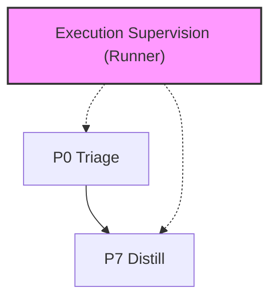

# @adlc/runner

**ADLC Phase:** Execution supervision

### ADLC Lifecycle Context




Artifact-asserting phase runner for ADLC.

## Usage

```sh
adlc run p5 --ticket T1 --dir .adlc --json
adlc run p6 --ticket T1 --dir .adlc
```

The runner does not treat "a command ran" as a gate. It checks `.adlc/manifest.jsonl`
for the evidence each phase requires. P3, P4, P5, and P6 evidence must be scoped to a
ticket; `adlc run p3`, `adlc run p4`, `adlc run p5`, and `adlc run p6` fail operationally
without `--ticket`.

For normal git worktree use, omit `--revision`. P5 and P6 use the current content
fingerprint and fail closed if reviewed content changes. Committing the exact content
reviewed at P5 does not move the fingerprint; changing tracked content, ignored ADLC
control files such as `.adlc/tickets.json`, or untracked non-artifact files after P5 makes
P6 fail closed until P5 is re-run.

Explicit `--revision` is an offline selector for recorded manifest and artifact evidence.
When supplied, the runner verifies the matching manifest entries, transcript hashes, review
packet hashes, ticket hash when available, and P6 packet/snapshot hashes without comparing
against the live git worktree.

Standard generated artifacts such as the active manifest/lock files, the exact packet path
passed to `adlc accept --packet ...`, and any exact snapshot paths passed with
`--before`/`--after` do not move the P6 fingerprint. In-worktree P6 packet and snapshot
paths must live under `.adlc/` or `.omo/evidence/`; source paths are rejected before they
can become fingerprint exclusions. The runner records hashes for the packet and snapshots
and re-verifies them at `adlc run p6`, so accepted behavior evidence is tamper-evident even
though its paths are excluded from the worktree fingerprint.

## Exit codes

- `0`: required phase artifacts are present
- `1`: operational error
- `2`: required phase artifacts are missing

## ADLC phase

Cross-phase. This package gives CI and Codex skills one stable command for asserting
phase completion.
