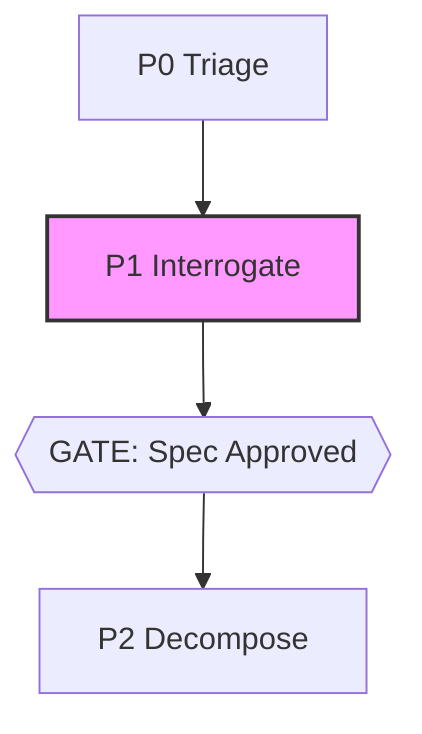

# spec-lint

**ADLC phase: P1 Interrogate**

### ADLC Lifecycle Context




Audits a spec for acceptance criteria that lack a concrete verification method.
Every acceptance criterion must name how it will be checked — a test file, a
command whose output is asserted, an explicit `verify:` label, an `assert`
statement, or an `exit code` reference. Criteria without one are **wishes**.
Wishes get flagged at exit 2, blocking CI until the spec is tightened.

## Usage

```sh
spec-lint <spec.md> [--llm] [--json] [--prompt-only]
```

### Flags

| Flag | Description |
|------|-------------|
| `--llm` | Run a cheap-tier LLM pass on VERIFIED criteria to catch vacuous methods ("works correctly", "run tests"). Demoted criteria become WISH. Requires a provider env var (see core). |
| `--json` | Emit machine-readable JSON (for orchestrators). All other output is suppressed. |
| `--prompt-only` | Print the exact LLM prompt and exit 0. Works with zero API keys — paste into any harness. |

### Exit codes

| Code | Meaning |
|------|---------|
| `0` | Gate passes — all criteria are verified (or no criteria found; warns loudly). |
| `1` | Operational error — file missing, unreadable, or LLM call failed. |
| `2` | Gate fails — one or more criteria are wishes (line numbers printed). |

## What counts as a verification method?

A criterion is **VERIFIED** if its text contains any of:

- A backtick command: `` `npm test` ``
- A path matching `*.test.<ext>` or `*.spec.<ext>`: `auth.spec.ts`
- `verify:` or `verified by` followed by text
- `test:` followed by text
- The phrase `exit code`
- The word `assert`

Everything else is a **WISH**.

## Where criteria are found

Criteria are extracted from:

1. **List items** (`-`, `*`, `1.`, `- [ ]`, `- [x]`) under any heading matching
   `/acceptance|criteria|requirements|definition of done|success/i`
2. **Standalone lines** starting with `MUST` or `SHOULD` (anywhere in the file)

## LLM demotion (--llm)

Even VERIFIED criteria can be vacuous. "Run tests and verify it works correctly"
contains a backtick command but conveys nothing checkable. The `--llm` flag sends
VERIFIED criteria to a cheap model asking it to identify vacuous methods and
returns a `{ vacuous: [indices], reason: {...} }` JSON object. Vacuous criteria
are demoted to WISH.

Use `--prompt-only` to get the exact prompt without making any API calls — useful
for testing, auditing, or pasting into a different model.

## JSON output

```json
{
  "file": "spec.md",
  "total": 5,
  "verified": 3,
  "wishes": 2,
  "criteria": [
    { "line": 8, "status": "VERIFIED", "text": "...", "reason": "..." },
    { "line": 9, "status": "WISH",     "text": "...", "reason": "no verification method found" }
  ]
}
```

## Example

```sh
# Run gate — exit 2 if any wishes
spec-lint docs/spec.md

# Machine-readable for CI
spec-lint docs/spec.md --json

# Inspect LLM prompt without API key
spec-lint docs/spec.md --prompt-only

# Full LLM-backed demotion pass
ANTHROPIC_API_KEY=sk-... spec-lint docs/spec.md --llm
```

## Relationship to sibling tools

- **C2 premortem** — after spec-lint passes, stress-test the approved spec with a
  frontier model (postmortem framing).
- **C3 coldstart** — per-ticket gap analysis; spec-lint gates the spec, coldstart
  gates individual tickets.
- **C11 gate-manifest** — spec-lint results should be appended to the manifest
  ledger after a gate run.

## Core gaps

None. All required functionality (`complete`, `extractJson`, `parseArgs`,
`pass`, `gateFail`, `opError`, `printJson`, `promptOnly`) is present in core.
