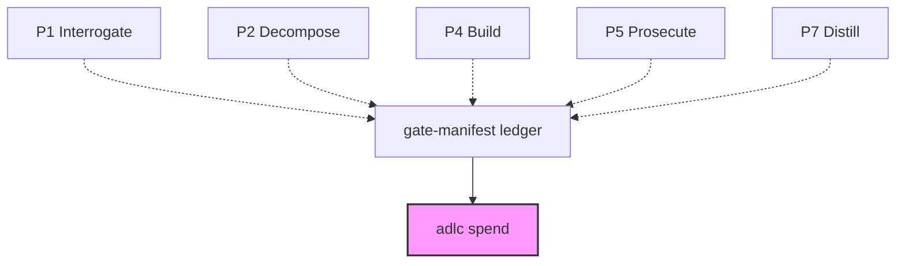

# spend

**ADLC Phase:** cross-cutting (reads the C11 evidence ledger; not itself a gate)

### ADLC Lifecycle Context



**ADLC §6 — the unit of account, instrumented.** ADLC.md §6 defines "cost per
merged, verified change" as the lifecycle's unit of account and a barbell
spend shape (heavy P1/P5, light P4) as the healthy target. `spend` aggregates
whatever token usage other gates have recorded into the C11 manifest, groups
it by ADLC phase, and checks it against the §6 diagnostics — turning a claim
made in prose into a number you can look at.

## What it is not

`spend` never fails a build and has no gate semantics — there is no "wrong"
spend shape a gate should block on. It is a report, read-only over the
manifest ledger.

It also does not collect usage itself. Usage is collected at the LLM
chokepoint (`@adlc/core`'s `complete()`/`fan()` accept an optional
`onUsage` callback) and *reported* by individual gates that choose to thread
it into their own `gate-manifest record` call as `data.usage`
(`{inputTokens, outputTokens, cachedTokens, provider, model, tier}`). A gate
that doesn't do this simply contributes no rows — `spend` shows exactly how
much of the ledger it could and couldn't account for
(`entriesWithUsage`/`entriesTotal`), rather than silently under-reporting.

## Usage

```
adlc spend [--ticket id] [--dir path] [--json]
```

- `--ticket id` — restrict to manifest entries recorded against one ticket.
- `--dir path` — ledger directory (default `.adlc`).
- `--json` — machine-readable aggregate: `{ byPhase, byGate, total, entriesWithUsage, entriesTotal }`.

Text output renders a per-phase histogram (P0–P7, `maintenance`, `unphased`
for gates not yet mapped to a phase) plus any §6 diagnostics that apply —
e.g. spend concentrated in P4, or heavy P5 spend with no P7 spend recorded.

## Phase attribution

Gate name → phase is a static table in `packages/gate-manifest/lib/spend.mjs`
(`PHASE_BY_GATE`), mirrored from the `/adlc:adlc` skill's canonical
phase-routing table. Like any other cache in this toolkit (ADLC Principle
10), it can go stale if a gate's phase assignment changes — an unrecognized
gate name surfaces under `unphased` rather than being silently mis-attributed
or dropped.

## Related

- [`gate-manifest`](./gate-manifest.md) — the ledger `spend` reads.
- [`model-router`](./model-router.md) — emits a per-ticket `budget` alongside
  its `{model, mode}` assignment (ADLC.md §D1); not yet cross-checked against
  actual recorded spend by this tool.
