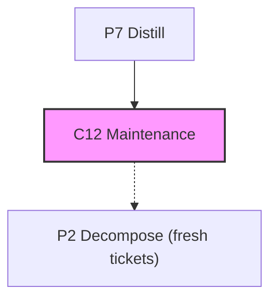

# @adlc/ticket-prune

**ADLC Phase:** C12 / maintenance

### ADLC Lifecycle Context



`.adlc/tickets.json` is a mutable working scratchpad. Nothing else prunes it
after a ticket's work ships, so completed tickets accumulate and masquerade as
an open backlog. `ticket-prune` reports (and, with `--write`, archives) tickets
it can determine are stale, dry-run by default like every other ADLC writer.

## Usage

```
ticket-prune [--tickets path] [--archive path] [--base-ref ref] [--write] [--json]
```

## How "stale" is decided

1. **Explicit `status` field wins when present.** `done` / `closed` /
   `complete` / `completed` / `archived` / `shipped` (case-insensitive) are
   stale; any other explicit status is treated as "not done" even if the
   ticket's scope looks fully shipped.
2. **Otherwise, infer from scope existing on a base ref.** A ticket with no
   status is stale only if it declares at least one `scope` glob and every
   glob resolves to a file tracked at `--base-ref` (default `HEAD`). A ticket
   with no declared scope is never inferred stale.

See `packages/ticket-prune/README.md` for the full reasoning, including why
"closing PR reference" was rejected as the corroborating signal.

## Flags

| Flag | Description |
|------|-------------|
| `--tickets <path>` | Ticket file to read (default `.adlc/tickets.json`). |
| `--archive <path>` | Archive file `--write` moves stale tickets into (default `.adlc/tickets.archive.json`, gitignored). |
| `--base-ref <ref>` | Git ref to check declared scope globs against (default `HEAD`). |
| `--write` | Archive stale tickets: remove them from `--tickets`, upsert into `--archive`. Never deletes outright. |
| `--json` | Machine-readable `{ baseRef, write, stale[], active[], archived[] }`. |

## Exit codes

| Code | Meaning |
|------|---------|
| `0` | Report or archive succeeded, regardless of how many stale tickets were found. Advisory (like `model-ratchet`), not a pass/fail gate. |
| `1` | Operational error — bad/missing ticket file, invalid JSON, unresolvable `--base-ref`, or the write lock could not be acquired. |

## Examples

```bash
# Report stale tickets on the currently checked-out ref (dry-run, default)
adlc ticket-prune

# Audit tickets against main from a feature branch
adlc ticket-prune --base-ref origin/main --json

# Archive the stale tickets found above
adlc ticket-prune --write
```

## Relationship to sibling tools

- **`ticket` (`@adlc/ticket-sync`)** — writes/reads `tickets.json` from an
  external tracker; shares the same `.adlc/tickets.lock` path so a sync and a
  prune never interleave.
- **`model-ratchet` / `skill-rot`** — the other decay-driven, dry-run-by-default
  maintenance checks wired into `/adlc-maintain`; `ticket-prune` follows the
  same reporting contract.

## Core gaps

`packages/core` (frozen) has no shared writer for `.adlc/tickets.json`.
`lib/store.mjs` re-implements the same mkdir-lock + tmp-rename protocol
`@adlc/ticket-sync`'s `lib/store.mjs` uses, at the same lock path.
