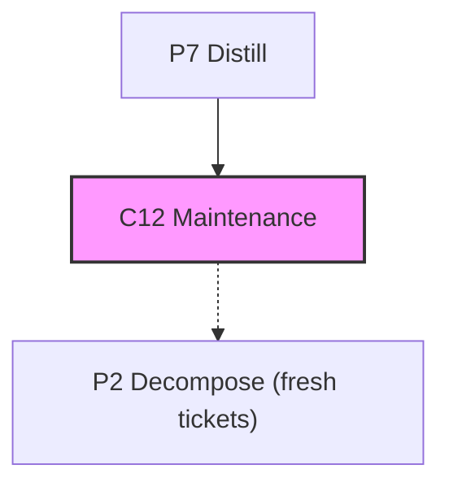

# @adlc/ticket-prune

**ADLC Phase:** C12 / maintenance

### ADLC Lifecycle Context



`.adlc/tickets.json` is a mutable working scratchpad. Nothing else prunes it
after a ticket's work ships, so completed tickets accumulate and masquerade as
an open backlog. `ticket-prune` reports (and, with `--write`, tombstones)
tickets it can determine are stale, dry-run by default like every other ADLC
writer.

## Usage

```
ticket-prune [--tickets path] [--base-ref ref] [--write] [--json]
```

## Tombstoning, not removal (#104)

`--write` adds `completed: true` to a stale ticket **in place** and changes
nothing else — it never removes the ticket or moves it to a side file.
`.adlc/tickets.json` is the rails-guard trust root, and its CI gate
(`scripts/rails-guard-ci.mjs`) hard-denies any PR that removes or mutates a base
ticket. Adding exactly `completed: true` to a **rails-less** ticket is the one
change that gate accepts (it grants no unfreeze privilege), so a routine prune
merges through an ordinary PR. A stale ticket that still freezes rails is left
untouched and surfaced under `needsCeremony`: completing it also expires its
rails, a privileged unfreeze reserved for the protected-base admin ceremony
(`ADLC_RAILS_BYPASS=1`).

Because the tombstone leaves the ticket in `tickets.json`, the backlog
enumerators (`merge-forecast`, `model-router`, `coldstart --all`) skip
`completed: true` tickets so finished work is no longer scheduled, routed, or
audited as open backlog — the completion is honored, not just recorded. A
by-id lookup (e.g. `coldstart <id>`) still sees completed tickets, so you can
always act on one you name explicitly.

## How "stale" is decided

1. **Explicit `status` field wins when present.** `done` / `closed` /
   `complete` / `completed` / `archived` / `shipped` (case-insensitive) are
   stale; any other explicit status is treated as "not done" even if the
   ticket's scope looks fully shipped.
2. **Otherwise, infer from scope existing on a base ref.** A ticket with no
   status is stale only if it declares at least one `scope` glob and every
   glob resolves to a file tracked at `--base-ref` (default `HEAD`). A ticket
   with no declared scope is never inferred stale.

See `packages/ticket-prune/README.md` for the full reasoning, including why
"closing PR reference" was rejected as the corroborating signal.

## Flags

| Flag | Description |
|------|-------------|
| `--tickets <path>` | Ticket file to read (default `.adlc/tickets.json`). |
| `--base-ref <ref>` | Git ref to check declared scope globs against (default `HEAD`). |
| `--write` | Tombstone rails-less stale tickets: add `completed: true` in place. Never removes; leaves rails-freezing stale tickets for the admin ceremony. |
| `--json` | Machine-readable `{ baseRef, write, stale[], active[], tombstoned[], needsCeremony[] }`. |

## Exit codes

| Code | Meaning |
|------|---------|
| `0` | Report or archive succeeded, regardless of how many stale tickets were found. Advisory (like `model-ratchet`), not a pass/fail gate. |
| `1` | Operational error — bad/missing ticket file, invalid JSON, unresolvable `--base-ref`, or the write lock could not be acquired. |

## Examples

```bash
# Report stale tickets on the currently checked-out ref (dry-run, default)
adlc ticket-prune

# Audit tickets against main from a feature branch
adlc ticket-prune --base-ref origin/main --json

# Tombstone the rails-less stale tickets found above (completed:true in place)
adlc ticket-prune --write
```

## Relationship to sibling tools

- **`ticket` (`@adlc/ticket-sync`)** — writes/reads `tickets.json` from an
  external tracker; shares the same `.adlc/tickets.lock` path so a sync and a
  prune never interleave.
- **`model-ratchet` / `skill-rot`** — the other decay-driven, dry-run-by-default
  maintenance checks wired into `/adlc-maintain`; `ticket-prune` follows the
  same reporting contract.

## Core gaps

`packages/core` (frozen) has no shared writer for `.adlc/tickets.json`.
`lib/store.mjs` re-implements the same mkdir-lock + tmp-rename protocol
`@adlc/ticket-sync`'s `lib/store.mjs` uses, at the same lock path.
